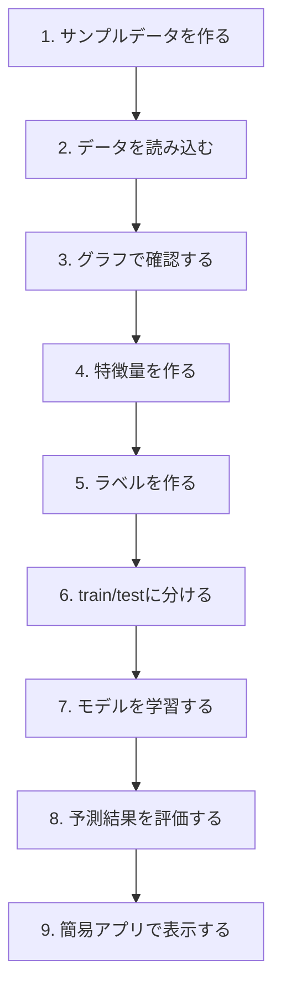
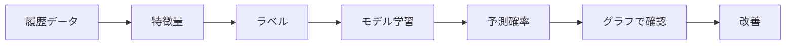

# 課題: Collectible Prediction Sandbox を作る

このドキュメントは、別リポジトリで **予測モデルの理解を目的とした小さな学習用アプリ** を作るための課題仕様です。

本番アプリ `Collectible Value Radar` をいきなり作るのではなく、まずは縮小版として、以下を体験することを目的にします。

- サンプルデータを作る
- 履歴データを扱う
- 特徴量を作る
- ラベルを作る
- 予測モデルを学習する
- 予測結果をグラフで確認する
- 簡易UIで確認する

この課題では、具体的な実装コードは記載しません。

自分で調べ、実装し、動かしながら理解することを目的にします。

---

## 1. この課題のゴール

最終的に、以下のような簡易アプリを作ります。

```text
Collectible Prediction Sandbox

目的:
コレクタブル商品のサンプルデータを使って、
30日後に価格が+30%以上上がるかを予測する流れを理解する。
```

完成イメージ：

| 機能 | 内容 |
|---|---|
| サンプルデータ生成 | 架空の商品、価格、SNS、検索量、出品数、イベントを作る |
| データ表示 | 商品ごとの履歴データを表で確認する |
| グラフ表示 | 価格、SNS、検索量、出品数の推移を見る |
| 特徴量作成 | 7日変化率、30日変化率、イベントまでの日数などを作る |
| ラベル作成 | 30日後に+30%以上上がったかを作る |
| モデル学習 | ロジスティック回帰などで予測モデルを作る |
| 予測表示 | 商品ごとに上昇確率を表示する |
| 検証 | 予測と実際の結果を比較する |

---

## 2. 学ぶべきこと

この課題で学ぶ範囲は、機械学習全般ではありません。

本アプリ開発に必要な最低限に絞ります。

| 優先 | 学ぶこと | 理由 |
|---:|---|---|
| 1 | 表データの扱い | 商品・価格・SNS・検索量を扱うため |
| 2 | 時系列データの扱い | 日付ごとの履歴を扱うため |
| 3 | 特徴量 | モデルに入力する材料を作るため |
| 4 | ラベル | モデルに学習させる正解を作るため |
| 5 | 教師あり学習 | 特徴量から結果を予測する基本 |
| 6 | ロジスティック回帰 | 上がる確率を理解しやすいため |
| 7 | train/test分割 | 過去で学習し、未来で検証するため |
| 8 | 評価指標 | モデルがどれくらい当たったか見るため |
| 9 | 可視化 | データや予測結果を理解するため |
| 10 | 簡易アプリ化 | フロントエンドで判断情報を見せる練習のため |

---

## 3. 推奨技術

実装技術は自由ですが、初心者向けには以下を推奨します。

| 用途 | 推奨 |
|---|---|
| 言語 | Python |
| データ処理 | pandas |
| モデル | scikit-learn |
| グラフ | matplotlib または plotly |
| 簡易アプリ | Streamlit |
| データ保存 | CSVから開始 |

最初からデータベースやWeb APIを使う必要はありません。

この課題では、まずCSVとローカルアプリで十分です。

---

## 4. 全体の流れ

この課題では、以下の順番で作ります。



---

## 5. 作るデータ

まずは、実データではなく、架空のサンプルデータを作ります。

実データを使わない理由：

- API取得や規約の問題に悩まず、予測モデルの理解に集中できる
- 正解ラベルを作りやすい
- どの特徴量が効くかを観察しやすい
- 失敗しても作り直しやすい

重要なのは、架空データの目的は **本番での予測精度を確認することではない** という点です。

架空データで高い精度が出ても、それは本番で当たることを意味しません。

架空データで確認するのは、以下です。

```text
データを作る
↓
特徴量を作る
↓
ラベルを作る
↓
モデルを学習する
↓
予測確率を出す
↓
評価する
↓
グラフで確認する
```

つまり、モデル構築の流れを練習するためのデータです。

精度は、あくまで **自分が作ったサンプル世界のルールをモデルが拾えているか** を見るものです。

### 5.1 商品データ

架空の商品を複数作ります。

例：

| item_id | item_name | ip_name | category | release_type |
|---|---|---|---|---|
| item_001 | ONE PIECE 特典カードA | ONE PIECE | bookstore_bonus | limited |
| item_002 | 映画特典カードB | 架空IP | movie_bonus | limited |
| item_003 | プロモカードC | 架空TCG | promo_card | limited |

最低でも、20〜50商品程度あると練習しやすいです。

### 5.2 日次スナップショット

各商品について、日付ごとの履歴を作ります。

| カラム | 内容 |
|---|---|
| date | 観測日 |
| item_id | 商品ID |
| price | 現在価格 |
| listing_count | 出品数 |
| sold_count | 売却件数 |
| sns_mentions | SNS言及数 |
| trends_score | Google Trends風の検索関心 |
| event_flag | イベントがあった日か |
| days_to_distribution_end | 配布終了までの日数 |

期間は、最低でも180日程度あると学習しやすいです。

### 5.3 イベントデータ

価格が動くきっかけとして、イベントも作ります。

| event_type | 内容 |
|---|---|
| announcement | 公式告知 |
| distribution_start | 配布開始 |
| distribution_end | 配布終了 |
| restock | 再配布/再販 |
| youtube_feature | 大手YouTube掲載 |
| overseas_signal | 海外需要の兆候 |

---

## 6. サンプルデータの前提

サンプルデータは、AIに作成してもらって構いません。

ただし、AIに丸投げするのではなく、以下の前提を明確に指定します。

### 6.1 データの目的

AIに作らせるサンプルデータの目的は、予測モデルの実装練習です。

目的：

| 目的 | 内容 |
|---|---|
| モデル構築の流れを理解する | 特徴量、ラベル、学習、予測、評価を体験する |
| グラフで動きを見る | 価格、SNS、検索量、出品数の前後関係を見る |
| 本番アプリの縮小版を作る | Collectible Value Radar の小さい練習版にする |
| 欠損処理を練習する | 本番に近い不完全データを扱う |

目的ではないこと：

| 目的ではない | 理由 |
|---|---|
| 本番精度の確認 | 架空データは現実市場ではないため |
| 実際の投資判断 | 架空商品なので意味がない |
| 高精度モデルの証明 | 自分で作ったルールを当てているだけの可能性がある |

### 6.2 Step 1は欠損なし

最初は、欠損なしのデータを作ります。

目的は、モデル構築の基本フローで詰まらないようにするためです。

Step 1で作るデータ：

| 条件 | 内容 |
|---|---|
| 欠損 | なし |
| 商品数 | 20〜50商品 |
| 期間 | 180日程度 |
| 日次データ | すべての日付・商品に対して存在する |
| イベント | 一部商品に付与する |
| 価格パターン | 上昇型、下落型、横ばい型、初動天井型を混ぜる |

この段階では、以下を理解できれば十分です。

```text
CSVを読む
特徴量を作る
ラベルを作る
モデルを学習する
グラフで確認する
```

### 6.3 Step 2は欠損あり

基本の流れを理解したら、欠損ありのデータにします。

本番では、すべてのデータが揃うことはほぼありません。

本番で起きる欠損例：

| 欠損 | 起きる理由 |
|---|---|
| Google Trendsがない | 検索量が少なすぎる |
| SNS言及数がない | API取得漏れ、話題化していない、キーワード不一致 |
| eBayデータがない | 海外出品がない、商品名が一致しない |
| 売却件数がない | 実売データが取れない、売れていない |
| イベント日がない | 手入力漏れ、公式告知が未取得 |
| 出品数がない | ソース側の取得失敗 |

Step 2で入れる欠損例：

| カラム | 欠損の入れ方 |
|---|---|
| trends_score | ニッチ商品では一部欠損 |
| sns_mentions | 一部日付で欠損 |
| sold_count | 一部商品で欠損 |
| overseas_price | 海外需要がない商品では欠損 |
| event_type | イベント未登録の商品では欠損 |
| listing_count | 一部日付で取得失敗として欠損 |

欠損率の目安：

| データ | 欠損率の目安 |
|---|---:|
| price | 0〜5% |
| listing_count | 5〜10% |
| sold_count | 10〜30% |
| sns_mentions | 5〜20% |
| trends_score | 20〜50% |
| overseas_price | 40〜70% |
| event_type | イベントがない日は空でよい |

### 6.4 欠損も特徴量にする

欠損は、単に邪魔なものではありません。

欠損自体が情報になる場合があります。

例：

| 欠損 | 意味する可能性 |
|---|---|
| Google Trendsがない | 検索量が少なすぎる |
| eBayデータがない | 海外需要がまだない |
| SNSデータがない | 話題化していない、または取得漏れ |
| 実売価格がない | 売れていない、または取得できない |
| イベント日がない | 公式イベントがない、または未入力 |

そのため、以下のような欠損フラグを特徴量にします。

| 欠損フラグ | 意味 |
|---|---|
| has_trends_data | Google Trendsデータがあるか |
| has_sns_data | SNSデータがあるか |
| has_sold_count | 売却件数データがあるか |
| has_overseas_data | 海外データがあるか |
| has_event | イベント情報があるか |
| missing_data_count | 欠損している項目数 |

### 6.5 AIにサンプルデータを作らせるときの指示

AIにサンプルデータを作成してもらう場合は、以下の条件を指定します。

| 指定項目 | 内容 |
|---|---|
| データ形式 | CSV |
| 商品数 | 20〜50商品 |
| 期間 | 180日程度 |
| 粒度 | 商品 × 日付 の日次データ |
| カテゴリ | 書店特典、映画特典、プロモカード、未開封BOXなど |
| パターン | 上昇型、初動天井型、横ばい型、再販下落型、海外需要後追い型 |
| イベント | 告知、配布開始、配布終了、再販、YouTube掲載、海外動意 |
| 欠損 | Step 1ではなし、Step 2では一部あり |
| 目的変数 | 30日後に+30%以上上がるか |

AIに依頼するときの指示文の例：

```text
コレクタブル価格予測モデルの練習用に、架空のサンプルCSVデータを作成してください。

目的は、本番の予測精度を確認することではなく、
特徴量作成、ラベル作成、モデル学習、評価、グラフ表示の流れを練習することです。

条件:
- 商品数は30件
- 期間は180日
- 粒度は商品 × 日付の日次データ
- カテゴリは書店特典、映画特典、プロモカード、未開封BOXを混ぜる
- カラムは date, item_id, item_name, ip_name, category, price, listing_count, sold_count, sns_mentions, trends_score, event_type, days_to_distribution_end を含める
- 商品ごとに、上昇型、初動天井型、横ばい型、再販下落型、海外需要後追い型のパターンを混ぜる
- Step 1用として、欠損なしのデータにする
- 価格、SNS、検索量、出品数がある程度連動するようにする
- ただし、完全に単純すぎる規則にはしない
- CSVとして保存しやすい形式で出力する
```

Step 2用の指示文の例：

```text
先ほどのサンプルデータに、本番に近い欠損を入れたバージョンを作成してください。

条件:
- priceはほぼ欠損なし
- listing_countは5〜10%欠損
- sold_countは10〜30%欠損
- sns_mentionsは5〜20%欠損
- trends_scoreはニッチ商品を中心に20〜50%欠損
- overseas_priceがある場合は40〜70%欠損
- event_typeはイベントがない日は空でよい
- 欠損がある理由を想定できるようにする
- 欠損フラグを後で作れるようにする
```

### 6.6 データパターンの例

AIに作ってもらうデータには、複数の価格パターンを混ぜます。

| パターン | 動き |
|---|---|
| 上昇型 | SNSや検索量が増えた後、価格が徐々に上がる |
| 初動天井型 | 配布直後に高騰し、出品数増加で下落する |
| 横ばい型 | SNSや検索量が弱く、価格も動かない |
| 再販下落型 | 再販イベント後、出品数が増えて価格が下がる |
| 海外需要後追い型 | 海外シグナル後、少し遅れて国内価格が上がる |
| 配布終了後上昇型 | 配布終了後に供給が減り、価格が上がる |

これにより、モデルがどのパターンを拾うのかを観察できます。

---

## 7. 作る特徴量

次に、履歴データから特徴量を作ります。

特徴量とは、モデルに入力する材料です。

この課題では、以下を作ることを目標にします。

| 特徴量 | 意味 |
|---|---|
| price_change_7d | 7日前からの価格変化率 |
| price_change_30d | 30日前からの価格変化率 |
| sns_change_7d | 7日前からのSNS言及増加率 |
| trends_change_7d | 7日前からの検索関心増加率 |
| listing_change_7d | 7日前からの出品数変化率 |
| sold_count_7d_sum | 直近7日間の売却件数 |
| days_to_distribution_end | 配布終了までの日数 |
| is_after_announcement | 告知後かどうか |
| is_after_distribution_end | 配布終了後かどうか |
| current_price | 現在価格 |
| current_listing_count | 現在の出品数 |

注意点：

```text
未来の情報を特徴量に入れてはいけない
```

例えば、7月10日に予測する場合、7月11日以降の価格やSNS言及を特徴量に入れてはいけません。

---

## 8. 作るラベル

ラベルとは、モデルに学習させる正解です。

この課題では、まず1つだけ作ります。

```text
30日後に現在価格より+30%以上上がったか
```

ラベル名の例：

| ラベル | 意味 |
|---|---|
| target_up_30d_30pct | 30日後に+30%以上上がったら1、そうでなければ0 |

例：

```text
今日の価格: 1,000円
30日後の価格: 1,400円
上昇率: +40%
target_up_30d_30pct = 1
```

```text
今日の価格: 1,000円
30日後の価格: 1,100円
上昇率: +10%
target_up_30d_30pct = 0
```

最初はこの1ラベルだけで十分です。

慣れてきたら、以下のラベルも追加できます。

| ラベル | 意味 |
|---|---|
| target_down_30d_20pct | 30日後に-20%以上下がったか |
| target_initial_spike | 初動天井だったか |
| target_liquid_14d | 14日以内に売れやすかったか |

---

## 9. モデル作成

最初のモデルは、ロジスティック回帰を推奨します。

理由：

- 仕組みが比較的分かりやすい
- 「上がる確率」を出しやすい
- 特徴量と結果の関係を観察しやすい
- 高度なモデルに進む前の基準になる

この課題でやること：

| 手順 | 内容 |
|---:|---|
| 1 | 特徴量とラベルを分ける |
| 2 | 学習用データとテスト用データに分ける |
| 3 | ロジスティック回帰で学習する |
| 4 | テストデータに対して予測する |
| 5 | 上昇確率を出す |
| 6 | 予測と実際のラベルを比較する |

### 9.1 分割方法

この課題では、ランダム分割ではなく、時系列分割を意識します。

悪い例：

```text
全期間のデータをランダムに混ぜて学習/テストに分ける
```

良い例：

```text
前半期間で学習
後半期間でテスト
```

理由：

```text
実運用では、未来のデータを使って過去を予測することはできないため
```

---

## 10. 評価すること

モデルを作ったら、必ず評価します。

最初に見る評価指標：

| 指標 | 意味 |
|---|---|
| accuracy | 全体でどれくらい当たったか |
| precision | 上がると予測したもののうち、本当に上がった割合 |
| recall | 実際に上がったものをどれくらい拾えたか |
| confusion matrix | 予測の当たり外れの内訳 |
| ROC-AUC | 確率予測のざっくりした分離性能 |

このアプリでは、特に precision が重要です。

理由：

```text
「上がる」と出した候補が外れすぎると、投資判断として信用されにくいため
```

ただし、precisionだけを見ると、候補をほとんど出さないモデルになりがちです。

そのため、precision と recall のバランスを見る必要があります。

---

## 11. グラフで確認すること

モデルの数字だけを見ても、理解は深まりにくいです。

必ずグラフで確認します。

作るべきグラフ：

| グラフ | 目的 |
|---|---|
| 価格推移 | 商品価格がどう動いたか見る |
| SNS言及推移 | SNSが価格より先に動いたか見る |
| 検索量推移 | 認知が広がったタイミングを見る |
| 出品数推移 | 供給が増えた/減ったタイミングを見る |
| イベント重ね表示 | 告知・配布終了などと価格変化を比較する |
| 予測確率推移 | モデルがいつ強気になったか見る |

グラフを見るときの問い：

| 問い | 見るもの |
|---|---|
| SNSは価格より先に動いたか | SNS言及と価格の前後関係 |
| 検索量が上がった後に価格は上がったか | trends_scoreとprice |
| 出品数が増えた後に価格は下がったか | listing_countとprice |
| 配布終了後に価格は上がったか | eventとprice |
| モデルは価格上昇前に確率を上げたか | prediction_probabilityとprice |

---

## 12. 簡易アプリで表示するもの

Streamlitなどで、簡易アプリを作ります。

画面は最小限でよいです。

### 12.1 商品一覧

| 表示項目 | 内容 |
|---|---|
| 商品名 | 架空の商品名 |
| IP名 | 作品名 |
| 現在価格 | 最新日の価格 |
| 予測確率 | 30日後に+30%以上上がる確率 |
| 実際のラベル | テスト期間で実際に上がったか |
| 判定 | Watch / Candidate / Risky など |

### 12.2 商品詳細

| 表示項目 | 内容 |
|---|---|
| 価格グラフ | price |
| SNSグラフ | sns_mentions |
| 検索量グラフ | trends_score |
| 出品数グラフ | listing_count |
| イベント表示 | event_type |
| 特徴量一覧 | モデルに入れた特徴量 |
| 予測結果 | 予測確率、実際の結果 |

### 12.3 モデル評価

| 表示項目 | 内容 |
|---|---|
| accuracy | 全体の正解率 |
| precision | 候補の当たり率 |
| recall | 上がった商品を拾えた割合 |
| confusion matrix | 当たり外れの内訳 |

---

## 13. 発展課題

基本課題ができたら、以下に挑戦します。

| 発展課題 | 学べること |
|---|---|
| Random Forestを試す | 条件分岐型モデルを理解する |
| XGBoost/LightGBMを試す | より実務的な表データモデルを理解する |
| 特徴量を追加する | 特徴量の重要性を体感する |
| ラベルを変える | 予測したい問いによって結果が変わることを理解する |
| 時系列分割を厳密にする | 未来情報混入を避ける練習 |
| 予測確率のしきい値を変える | precision/recallのトレードオフを理解する |
| イベント種類を増やす | カタリスト分析の練習 |
| 本物の小さなCSVを使う | 実データの欠損・ノイズを体験する |

---

## 14. 実装時の注意点

初心者がつまずきやすい点を先に整理します。

| 注意点 | 内容 |
|---|---|
| 最初から完璧にしない | まず動くものを作る |
| 実データから始めない | 取得や欠損で詰まりやすい |
| モデル精度にこだわりすぎない | 最初の目的は理解 |
| 未来情報を入れない | 予測時点で見えていた情報だけを使う |
| 特徴量を増やしすぎない | 最初は少数でよい |
| グラフを必ず見る | 数字だけでは理解しにくい |
| 評価指標を複数見る | accuracyだけだと誤解しやすい |
| 予測が外れた例を見る | 外れた理由から学べる |
| 架空データの精度を過信しない | 本番精度を意味しない |
| 欠損なしで慣れてから欠損ありに進む | 最初から欠損ありだとデータ処理で詰まりやすい |

---

## 15. 学習用参考資料

以下は、この課題に必要な範囲を学ぶための参考資料です。

| 資料 | 学ぶこと |
|---|---|
| scikit-learn Getting Started | 機械学習モデルの基本的な使い方 |
| Google Machine Learning Crash Course | 特徴量、ラベル、分類、過学習などの基礎 |
| pandas Getting Started | CSV読み込み、表データ処理 |
| matplotlib Getting Started | 基本的なグラフ描画 |
| Streamlit Get Started | Pythonで簡易データアプリを作る方法 |

学ぶ順番：

```text
1. pandasでCSVを読む
2. グラフを描く
3. 特徴量を作る
4. ラベルを作る
5. scikit-learnでモデルを学習する
6. 評価指標を見る
7. Streamlitで表示する
```

---

## 16. この課題で理解してほしいこと

この課題の本当の目的は、精度の高いモデルを作ることではありません。

以下を体感することです。

- 予測モデルは、特徴量とラベルがないと作れない
- 履歴データがないと特徴量もラベルも作れない
- 未来情報を混ぜると、見かけ上だけ高精度になる
- 価格だけでなく、SNS、検索量、出品数、イベントを組み合わせる意味がある
- モデルの予測は、グラフで見ないと理解しにくい
- accuracyだけでなく、precisionやrecallも見る必要がある
- 予測モデルは「魔法」ではなく、過去のパターンを数値化して使う仕組みである
- 架空データの高精度は、本番で当たることを意味しない
- 欠損は本番で避けられず、欠損自体も特徴量になることがある

最終的に、以下の流れを自分で説明できるようになることを目標にします。



---

## 17. 実施計画

この課題は、期限を決めて取り組みます。

前提：

| 項目 | 内容 |
|---|---|
| 期間 | 4週間 |
| 作業時間 | 1日約2時間 |
| 週あたり | 約14時間 |
| 総作業時間 | 約56時間 |
| 目的 | 高精度モデルではなく、予測モデル構築の流れを理解する |

開始日を 2026年6月30日 とする場合、期限は以下です。

```text
開始: 2026年6月30日
期限: 2026年7月28日
期間: 4週間
```

---

### 17.1 4週間の全体計画

| 週 | 目標 | 作業内容 |
|---:|---|---|
| 1週目 | データを作って可視化する | 架空データ作成、CSV読み込み、価格/SNS/検索量/出品数グラフ |
| 2週目 | 特徴量とラベルを作る | 7日変化率、30日変化率、30日後+30%ラベル、時系列分割 |
| 3週目 | モデルを学習・評価する | ロジスティック回帰、予測確率、accuracy/precision/recall、外れ例確認 |
| 4週目 | 簡易アプリ化・欠損ありデータ対応 | Streamlit表示、商品一覧、詳細グラフ、欠損処理、欠損フラグ |

---

### 17.2 週ごとの完了条件

| 週 | 完了条件 |
|---:|---|
| 1週目 | 欠損なしサンプルCSVを作り、最低3種類のグラフを表示できる |
| 2週目 | 特徴量テーブルとラベル列を作れる |
| 3週目 | ロジスティック回帰で予測確率を出し、評価指標を見られる |
| 4週目 | 簡易アプリで商品一覧・商品詳細・グラフ・予測結果を見られる |

---

### 17.3 1日の進め方

1日2時間を、以下のように使います。

| 時間 | 内容 |
|---:|---|
| 15分 | 前回の復習・今日やること確認 |
| 75分 | 実装 |
| 20分 | 動作確認・グラフ確認 |
| 10分 | メモを書く |

毎日の最後に、以下を短くメモします。

```text
今日やったこと
詰まったこと
分かったこと
次にやること
```

このメモは、後から本番アプリに戻るときの学習ログになります。

---

### 17.4 進め方の原則

完璧に作ろうとしないことが重要です。

この課題の目的は、完成度の高いアプリを作ることではなく、予測モデルの流れを理解することです。

進め方：

```text
1週目: 動くデータを見る
2週目: モデルに入れる形にする
3週目: 予測する
4週目: アプリとして眺める
```

4週間後のゴール：

> 自分で「履歴データ → 特徴量 → ラベル → モデル → 予測確率 → 評価 → グラフ表示」の流れを説明できる状態。

---

## 18. 完了条件

この課題は、以下を満たせば完了です。

| 完了条件 | 確認 |
|---|---|
| 架空の履歴データを作成できた | 商品、日付、価格、SNS、検索量、出品数がある |
| 特徴量を作成できた | 7日変化率などがある |
| ラベルを作成できた | 30日後+30%以上上昇ラベルがある |
| モデルを学習できた | ロジスティック回帰などが動く |
| 予測確率を出せた | 商品ごとの確率が見える |
| 評価指標を見られた | accuracy, precision, recallなど |
| グラフで確認できた | 価格・SNS・検索量・イベントが見える |
| 簡易アプリで表示できた | 商品一覧と商品詳細がある |
| 自分の言葉で説明できる | データ、特徴量、ラベル、モデル、評価の流れを説明できる |
| 欠損ありデータも扱えた | 欠損処理と欠損フラグを試せた |
