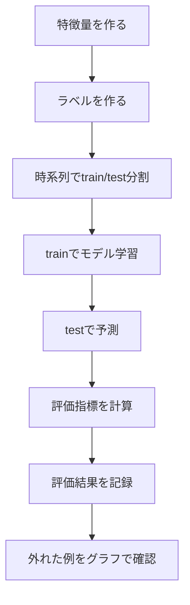
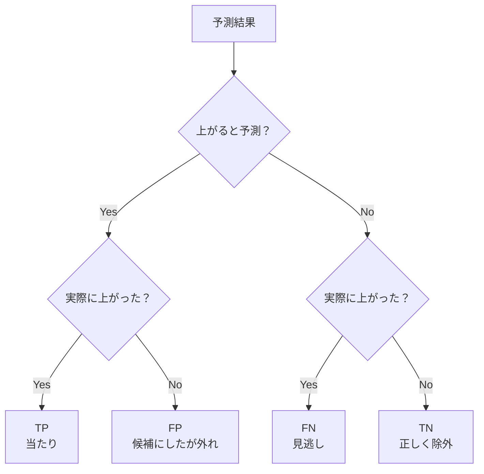
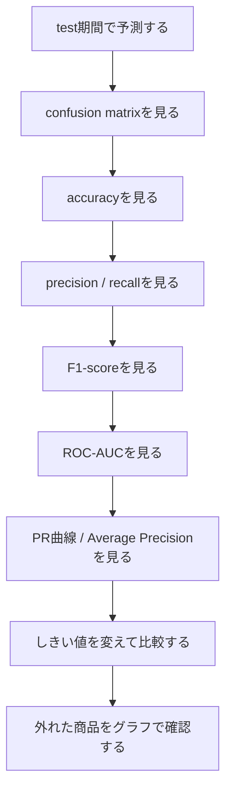

# 分類モデルの評価方法

作成日: 2026-07-05 JST

## このドキュメントの目的

今回の課題では、次の問いを予測する。

```text
30日後に価格が +30%以上 上がるか
```

これは二値分類問題。

```text
上がる     -> 1
上がらない -> 0
```

このドキュメントでは、分類モデルをどう評価するかを、データサイエンス初学者向けに整理する。

モデルを作るだけでは不十分。
モデルがどのように当たり、どのように外れているかを評価する必要がある。

## 評価の全体像

評価は、モデルを学習した後に行う。

今回の基本的な流れ:



重要なのは、評価には **正解ラベル** が必要ということ。

今回なら、評価時には以下を比べる。

| 種類 | 内容 |
|---|---|
| 実際の結果 | `target_up_30d_30pct` |
| モデルの予測 | 上がる / 上がらない |
| モデルの確率 | 上がる確率 |

## 評価方法一覧

| 評価方法 | 何を見るか | 今回の重要度 |
|---|---|---:|
| confusion matrix | 当たり外れの内訳 | 高 |
| accuracy | 全体の正解率 | 中 |
| precision | 上がると予測したものの当たり率 | 高 |
| recall | 実際に上がったものを拾えた割合 | 高 |
| F1-score | precisionとrecallのバランス | 中 |
| ROC-AUC | 確率の順位付け性能 | 中 |
| PR曲線 / Average Precision | 正例が少ないときの性能 | 高 |
| classification report | 主要指標の一覧 | 中 |
| しきい値別評価 | どの確率以上を候補にするか | 高 |

## 評価方法とモデル・データの相性

評価方法は、特定のモデルだけに対応するというより、次の条件で選ぶ。

```text
1. モデルが何を出力できるか
2. データの正例・負例のバランス
3. FPとFNのどちらを避けたいか
4. 確率の順位付けを見たいか
5. 最終的にしきい値を調整したいか
```

scikit-learn公式ドキュメントでも、分類指標の中には、正例クラスの確率や `decision_function` のようなスコアを必要とするものがあると説明されている。

つまり、評価方法には大きく2種類ある。

| 種類 | 必要な予測出力 | 例 |
|---|---|---|
| ラベル評価 | `0` / `1` の予測ラベル | accuracy, precision, recall, F1, confusion matrix |
| スコア評価 | 上昇確率やdecision score | ROC-AUC, PR曲線, Average Precision, しきい値別評価 |

### 評価方法別の相性

| 評価方法 | 必要な出力 | 相性の良いデータ・目的 | 相性の良いモデル | 今回の位置づけ |
|---|---|---|---|---|
| confusion matrix | 予測ラベル | 当たり外れの内訳を見たい | すべての分類モデル | 最初に必ず見る |
| accuracy | 予測ラベル | クラス比率が極端に偏っていない | すべての分類モデル | 参考値 |
| precision | 予測ラベル | FPを減らしたい、候補の質を重視 | すべての分類モデル | 重要 |
| recall | 予測ラベル | FNを減らしたい、見逃しを減らしたい | すべての分類モデル | 重要 |
| F1-score | 予測ラベル | precisionとrecallをまとめて見たい | すべての分類モデル | 参考 |
| ROC-AUC | 確率またはスコア | 順位付け性能を見たい | 確率・スコアを出せるモデル | 中 |
| PR曲線 | 確率またはスコア | 正例が少ない、候補品質を見たい | 確率・スコアを出せるモデル | 重要 |
| Average Precision | 確率またはスコア | PR曲線を数値で比較したい | 確率・スコアを出せるモデル | 重要 |
| しきい値別評価 | 確率またはスコア | Candidate / Watchの基準を決めたい | 確率・スコアを出せるモデル | 重要 |

### モデル出力との相性

| モデル | 予測ラベル | 確率 | decision score | 評価での注意 |
|---|---:|---:|---:|---|
| ロジスティック回帰 | 使える | 使える | 使える | 確率評価と相性が良い |
| 決定木 | 使える | 使える | 通常は使わない | 確率が荒くなりやすい |
| Random Forest | 使える | 使える | 通常は使わない | 確率や重要度を見やすい |
| Gradient Boosting | 使える | 使える | 使える場合あり | ROC-AUCやPR曲線と相性が良い |
| LightGBM / XGBoost | 使える | 使える | 使える | 確率・ランキング評価と相性が良い |
| SVM | 使える | 設定次第 | 使える | `probability=True` は追加計算が必要 |
| k近傍法 | 使える | 使える | 通常は使わない | 確率は近傍の比率なので解釈に注意 |
| ナイーブベイズ | 使える | 使える | 通常は使わない | 確率の校正には注意 |
| ニューラルネットワーク | 使える | 使える | 通常は使わない | データ量と過学習に注意 |

### データの性質との相性

| データの状態 | 向いている評価方法 | 理由 |
|---|---|---|
| 正例・負例が比較的バランスしている | accuracy, ROC-AUC | 全体正解率や順位付けを見やすい |
| 正例が少ない | precision, recall, PR曲線, Average Precision | 正例をどれだけ良く拾えたかが重要 |
| FPを減らしたい | precision, しきい値別評価 | 候補の外れを減らしたい |
| FNを減らしたい | recall, しきい値別評価 | 見逃しを減らしたい |
| 候補リストを作りたい | precision, PR曲線, Average Precision | 候補の質と拾い漏れを見たい |
| 確率順にランキングしたい | ROC-AUC, Average Precision | 確率の順位付け性能を見る |

今回のデータでは、`target_up_30d_30pct` の正例率が低めになる。

そのため、accuracyだけでなく、次を重視する。

```text
precision
recall
PR曲線
Average Precision
しきい値別評価
```

## 1. Confusion Matrix

### 何を見るか

confusion matrixは、予測と実際の結果の組み合わせを見る表。

日本語では混同行列と呼ばれる。

今回の二値分類では、次の4種類に分かれる。

|  | 実際に上がった | 実際は上がらなかった |
|---|---:|---:|
| 上がると予測 | TP | FP |
| 上がらないと予測 | FN | TN |

| 記号 | 意味 | 今回の例 |
|---|---|---|
| TP | True Positive | 上がると予測し、実際に上がった |
| FP | False Positive | 上がると予測したが、実際は上がらなかった |
| FN | False Negative | 上がらないと予測したが、実際は上がった |
| TN | True Negative | 上がらないと予測し、実際も上がらなかった |

### 図で見る



### 何に使うか

他の指標の土台になる。

まずconfusion matrixを見ると、

```text
上がる候補を出しすぎているのか
上がる商品を見逃しすぎているのか
```

が分かる。

### 今回の見方

今回、特に気にするのは `FP` と `FN`。

| 種類 | 問題 |
|---|---|
| FPが多い | 候補にした商品が外れすぎる |
| FNが多い | 実際に上がる商品を見逃しすぎる |

### 相性

| 観点 | 内容 |
|---|---|
| 相性の良いモデル | すべての分類モデル |
| 相性の良いデータ | すべての分類データ |
| 向いている目的 | 評価の最初に、何が起きているか把握する |

参考:

- scikit-learn confusion_matrix: https://scikit-learn.org/stable/modules/generated/sklearn.metrics.confusion_matrix.html

## 2. Accuracy

### 何を見るか

accuracyは、全体のうちどれくらい正解したかを見る指標。

```text
accuracy = 正解数 / 全体数
```

confusion matrixで書くと、

```text
accuracy = (TP + TN) / (TP + FP + FN + TN)
```

### 長所

- 直感的に分かりやすい
- 最初のざっくり確認に使える

### 短所

正例が少ないデータでは、誤解しやすい。

たとえば、実際に上がる商品が10%しかない場合、

```text
全部「上がらない」と予測
```

しても、accuracyは90%になる。

しかし、それでは上がる商品を1つも見つけられていない。

### 今回の使い方

accuracyだけで判断しない。

必ずprecision、recall、confusion matrixと一緒に見る。

### 相性

| 観点 | 内容 |
|---|---|
| 相性の良いモデル | すべての分類モデル |
| 相性の良いデータ | 正例・負例の比率が極端に偏っていないデータ |
| 向いている目的 | 全体の正解率をざっくり見る |
| 向いていない場面 | 正例が少ない不均衡データ |

参考:

- scikit-learn accuracy_score: https://scikit-learn.org/stable/modules/generated/sklearn.metrics.accuracy_score.html

## 3. Precision

### 何を見るか

precisionは、

```text
上がると予測した商品のうち、本当に上がった割合
```

を見る指標。

```text
precision = TP / (TP + FP)
```

### 今回の意味

今回のアプリでは、precisionはかなり重要。

理由:

```text
上がる候補として出した商品が外れすぎると、
判断材料として信用しにくいため
```

### 例

```text
上がると予測した商品: 10件
そのうち実際に上がった商品: 6件

precision = 6 / 10 = 0.60
```

### 使う場面

| 場面 | precisionが重要な理由 |
|---|---|
| 候補リストを出す | 候補の質を高めたい |
| 誤った推薦を減らしたい | FPを減らしたい |
| 調査対象を絞りたい | 無駄な確認を減らしたい |

### 注意点

precisionだけを高くしようとすると、モデルが候補をほとんど出さなくなることがある。

そのため、recallと一緒に見る。

### 相性

| 観点 | 内容 |
|---|---|
| 相性の良いモデル | すべての分類モデル |
| 相性の良いデータ | 正例が少ないデータ、候補を絞りたいデータ |
| 向いている目的 | FPを減らし、候補の当たり率を上げる |
| 向いていない使い方 | 見逃しを無視してprecisionだけ最大化する |

参考:

- scikit-learn precision_score: https://scikit-learn.org/stable/modules/generated/sklearn.metrics.precision_score.html

## 4. Recall

### 何を見るか

recallは、

```text
実際に上がった商品のうち、どれくらい拾えたか
```

を見る指標。

```text
recall = TP / (TP + FN)
```

### 今回の意味

recallが低い場合、

```text
本当は上がった商品をかなり見逃している
```

ということ。

### 例

```text
実際に上がった商品: 20件
そのうちモデルが上がると予測できた商品: 8件

recall = 8 / 20 = 0.40
```

### 使う場面

| 場面 | recallが重要な理由 |
|---|---|
| 見逃しを減らしたい | FNを減らしたい |
| 広めに候補を拾いたい | チャンスを逃しにくくする |
| 後で人間が絞り込む | まず候補を広く出したい |

### 注意点

recallだけを高くしようとすると、何でも「上がる」と予測しやすくなる。
その場合、precisionが下がる。

### 相性

| 観点 | 内容 |
|---|---|
| 相性の良いモデル | すべての分類モデル |
| 相性の良いデータ | 正例を見逃したくないデータ |
| 向いている目的 | FNを減らし、上がる商品を広く拾う |
| 向いていない使い方 | 候補の外れを無視してrecallだけ最大化する |

参考:

- scikit-learn recall_score: https://scikit-learn.org/stable/modules/generated/sklearn.metrics.recall_score.html

## 5. PrecisionとRecallのトレードオフ

precisionとrecallは、しばしばトレードオフになる。

```text
候補を厳しく絞る
↓
precisionは上がりやすい
recallは下がりやすい

候補を広く出す
↓
recallは上がりやすい
precisionは下がりやすい
```

### しきい値の例

モデルが上昇確率を出す場合、

```text
上昇確率が 0.50 以上なら候補
```

のようなしきい値を決める。

このしきい値を変えると、precisionとrecallが変わる。

| しきい値 | 候補数 | precision | recall | 意味 |
|---:|---:|---:|---:|---|
| 0.30 | 多い | 下がりやすい | 上がりやすい | 広く拾う |
| 0.50 | 中 | 中 | 中 | 標準 |
| 0.70 | 少ない | 上がりやすい | 下がりやすい | 厳しく絞る |

### 今回の考え方

最初は `0.50` でよい。

その後、

```text
Candidateとして表示するならprecisionをどれくらい重視するか
Watchとして広めに拾うならrecallをどれくらい重視するか
```

を考える。

参考:

- scikit-learn Precision-Recall example: https://scikit-learn.org/stable/auto_examples/model_selection/plot_precision_recall.html
- scikit-learn precision_recall_curve: https://scikit-learn.org/stable/modules/generated/sklearn.metrics.precision_recall_curve.html

## 6. F1-score

### 何を見るか

F1-scoreは、precisionとrecallのバランスを見る指標。

scikit-learn公式ドキュメントでは、F1-scoreはprecisionとrecallの調和平均として説明されている。

```text
F1 = 2 * precision * recall / (precision + recall)
```

### 使う場面

precisionとrecallのどちらも大事で、1つの数字でざっくり比較したいとき。

### 長所

- precisionとrecallのバランスを見られる
- accuracyより不均衡データに強い場合がある

### 短所

- precisionとrecallのどちらを重視したいかが隠れる
- ビジネス目的に合わないことがある

### 今回の使い方

F1-scoreは参考として見る。

ただし、今回の目的ではprecisionとrecallを別々に見た方がよい。

### 相性

| 観点 | 内容 |
|---|---|
| 相性の良いモデル | すべての分類モデル |
| 相性の良いデータ | precisionとrecallを同じくらい重視したいデータ |
| 向いている目的 | モデルを1つの数値でざっくり比較する |
| 向いていない使い方 | precisionとrecallのどちらを重視するか明確な場合 |

参考:

- scikit-learn f1_score: https://scikit-learn.org/stable/modules/generated/sklearn.metrics.f1_score.html

## 7. ROC-AUC

### 何を見るか

ROC-AUCは、モデルが正例を負例より高いスコアにできているかを見る指標。

簡単に言うと、

```text
上がる商品に高い確率を付け、
上がらない商品に低い確率を付けられているか
```

を見る。

### ROC曲線の軸

| 軸 | 意味 |
|---|---|
| TPR | recallと同じ。実際の正例をどれくらい拾えたか |
| FPR | 実際は負例なのに、正例と予測した割合 |

### 使う場面

| 場面 | 理由 |
|---|---|
| 確率やスコアの順位付けを見たい | しきい値に依存しにくい |
| モデル同士をざっくり比較したい | 1つの数値で見られる |

### 注意点

正例が少ない場合、ROC-AUCだけだと実感とズレることがある。

今回のように「上がる商品」が少ない場合は、PR曲線やAverage Precisionも見る。

### 相性

| 観点 | 内容 |
|---|---|
| 相性の良いモデル | 確率またはスコアを出せるモデル |
| 相性の良いデータ | 正例・負例の順位付けを見たいデータ |
| 向いている目的 | 上がる商品に高いスコアを付けられているか見る |
| 向いていない使い方 | 正例が少ないデータでROC-AUCだけを見る |

参考:

- scikit-learn roc_auc_score: https://scikit-learn.org/stable/modules/generated/sklearn.metrics.roc_auc_score.html

## 8. PR曲線とAverage Precision

### 何を見るか

PR曲線は、precisionとrecallの関係を見る曲線。

scikit-learnのPrecision-Recall exampleでは、クラスが不均衡な場合にPrecision-Recallが有用と説明されている。

Average Precisionは、PR曲線を1つの数値にまとめたもの。

scikit-learn公式ドキュメントでは、Average Precisionはprecision-recall curveを要約する指標として説明されている。

### 今回なぜ重要か

今回のラベルは、正例が少なめになる。

たとえば、以前の確認では、

```text
target_up_30d_30pct の正例率は約13%
```

だった。

このような場合、accuracyだけでは判断しにくい。
PR曲線やAverage Precisionを見ると、

```text
上がる商品を候補としてどれくらい良く拾えているか
```

を見やすい。

### 使う場面

| 場面 | 理由 |
|---|---|
| 正例が少ない | precisionとrecallの関係が重要 |
| 候補リストを作る | 候補の質と拾い漏れを見たい |
| しきい値を決めたい | どの確率以上を候補にするか考えられる |

### 相性

| 観点 | 内容 |
|---|---|
| 相性の良いモデル | 確率またはスコアを出せるモデル |
| 相性の良いデータ | 正例が少ない不均衡データ |
| 向いている目的 | 候補リストの質と拾い漏れを同時に見る |
| 向いていない使い方 | 正例率の違うデータ同士を単純比較する |

参考:

- scikit-learn average_precision_score: https://scikit-learn.org/stable/modules/generated/sklearn.metrics.average_precision_score.html
- scikit-learn precision_recall_curve: https://scikit-learn.org/stable/modules/generated/sklearn.metrics.precision_recall_curve.html

## 9. Classification Report

### 何を見るか

classification reportは、precision、recall、F1-score、supportをまとめて表示するもの。

supportは、そのクラスの実データ数。

| 項目 | 意味 |
|---|---|
| precision | 予測したものの当たり率 |
| recall | 実際の正例を拾えた割合 |
| F1-score | precisionとrecallのバランス |
| support | 実際の件数 |

### 使う場面

モデル評価の最初の一覧として便利。

ただし、classification reportだけで終わらず、confusion matrixやPR曲線も見る。

### 相性

| 観点 | 内容 |
|---|---|
| 相性の良いモデル | すべての分類モデル |
| 相性の良いデータ | precision, recall, F1を一覧で見たいデータ |
| 向いている目的 | 評価結果の概要を素早く確認する |
| 向いていない使い方 | 詳細な外れ方やしきい値の影響を見る |

参考:

- scikit-learn classification_report: https://scikit-learn.org/stable/modules/generated/sklearn.metrics.classification_report.html

## 10. 確率としきい値の評価

### 何を見るか

分類モデルには、単に `0` / `1` を出すだけでなく、確率を出せるものがある。

今回なら、

```text
30日後に上がる確率
```

を出す。

この確率を、どこで `Candidate` と判定するかが重要。

### 例

| 上昇確率 | 判定例 |
|---:|---|
| 0.80 | Candidate |
| 0.55 | Watch |
| 0.20 | Ignore |

この境界は、モデルが自動で決めるというより、アプリの目的に応じて人間が決める。

### 今回の使い方

最初は単純に、

```text
0.50以上 = 上がると予測
```

でよい。

その後、precisionとrecallを見ながら、

```text
0.60以上をCandidateにする
0.40以上をWatchにする
```

のように調整する。

### 相性

| 観点 | 内容 |
|---|---|
| 相性の良いモデル | 確率またはスコアを出せるモデル |
| 相性の良いデータ | 候補をランク付けしたいデータ |
| 向いている目的 | Candidate / Watch / Ignore の境界を決める |
| 向いていない使い方 | 確率やスコアが出ないモデルで無理に使う |

## 今回のおすすめ評価順

今回の課題では、以下の順番で評価する。



### 最初に必ず見るもの

| 優先度 | 評価方法 | 理由 |
|---:|---|---|
| 1 | confusion matrix | 当たり外れの内訳が分かる |
| 2 | precision | 候補の当たり率を見る |
| 3 | recall | 上がった商品を見逃していないか見る |
| 4 | accuracy | 全体の正解率を参考に見る |
| 5 | ROC-AUC | 確率の順位付けを見る |

### 慣れてきたら見るもの

| 評価方法 | 理由 |
|---|---|
| PR曲線 | precisionとrecallのトレードオフを見る |
| Average Precision | PR曲線を1つの数値で比較する |
| しきい値別のprecision / recall | Candidate判定の基準を考える |
| 外れ例のグラフ確認 | なぜ外れたかを学ぶ |

## 今回の評価で重視すること

このアプリは、上がる候補を表示することを想定している。

そのため、特に重要なのは次の2つ。

```text
precision
recall
```

ただし、優先順位は少し違う。

| 指標 | 今回の意味 | 優先度 |
|---|---|---:|
| precision | 候補として出したものが当たるか | 高 |
| recall | 上がる商品をどれくらい拾えるか | 中〜高 |
| accuracy | 全体で当たるか | 中 |
| ROC-AUC | 確率の順位付けが良いか | 中 |
| F1-score | precisionとrecallのバランス | 中 |

最初は、次のように考える。

```text
precisionが低すぎる
-> 候補が外れすぎている

recallが低すぎる
-> 上がる商品を見逃しすぎている

accuracyだけ高い
-> 上がらない商品ばかり当てている可能性がある
```

## モデルごとの評価の使い方

| モデル | まず見る評価 |
|---|---|
| ロジスティック回帰 | precision, recall, ROC-AUC |
| 決定木 | confusion matrix, precision, recall |
| Random Forest | precision, recall, feature importance, ROC-AUC |
| Gradient Boosting | precision, recall, PR曲線, ROC-AUC |
| LightGBM / XGBoost | PR曲線, Average Precision, ROC-AUC |

どのモデルでも、評価の基本は同じ。

```text
同じtest期間
同じ特徴量
同じラベル
同じ評価指標
```

で比べる。

## 注意点

### 1. accuracyだけで判断しない

正例が少ない場合、accuracyは高く見えやすい。

今回のように「上がる商品」が少ない場合、

```text
全部上がらないと予測
```

しても、それなりに高いaccuracyが出る可能性がある。

### 2. 評価指標は目的に合わせる

モデルの良し悪しは、目的によって変わる。

| 目的 | 重視する指標 |
|---|---|
| 候補の当たり率を上げたい | precision |
| 見逃しを減らしたい | recall |
| バランスを見たい | F1-score |
| 確率の順位付けを見たい | ROC-AUC |
| 正例が少ない中で候補品質を見たい | PR曲線 / Average Precision |

### 3. しきい値を変えると評価も変わる

同じモデルでも、しきい値を変えるとprecisionとrecallが変わる。

```text
0.30以上を候補
0.50以上を候補
0.70以上を候補
```

は、すべて違う評価になる。

### 4. 数字だけで終わらない

評価指標を見たら、外れた商品をグラフで確認する。

今回の学習目的では、

```text
なぜ外れたか
どの特徴量が足りなかったか
どのイベントを拾えていないか
```

を考えることが重要。

## まとめ

今回の評価では、まず以下を見る。

```text
confusion matrix
precision
recall
accuracy
ROC-AUC
```

慣れてきたら、次も見る。

```text
PR曲線
Average Precision
しきい値別のprecision / recall
外れ例のグラフ確認
```

最重要ポイント:

```text
評価は、モデルを試すたびに行う
accuracyだけで判断しない
precisionとrecallを必ず見る
数字を見た後、グラフで外れ例を確認する
```

## 参考リンク

- scikit-learn Model evaluation: https://scikit-learn.org/stable/modules/model_evaluation.html
- scikit-learn metrics API: https://scikit-learn.org/stable/api/sklearn.metrics.html
- scikit-learn confusion_matrix: https://scikit-learn.org/stable/modules/generated/sklearn.metrics.confusion_matrix.html
- scikit-learn accuracy_score: https://scikit-learn.org/stable/modules/generated/sklearn.metrics.accuracy_score.html
- scikit-learn precision_score: https://scikit-learn.org/stable/modules/generated/sklearn.metrics.precision_score.html
- scikit-learn recall_score: https://scikit-learn.org/stable/modules/generated/sklearn.metrics.recall_score.html
- scikit-learn f1_score: https://scikit-learn.org/stable/modules/generated/sklearn.metrics.f1_score.html
- scikit-learn roc_auc_score: https://scikit-learn.org/stable/modules/generated/sklearn.metrics.roc_auc_score.html
- scikit-learn average_precision_score: https://scikit-learn.org/stable/modules/generated/sklearn.metrics.average_precision_score.html
- scikit-learn precision_recall_curve: https://scikit-learn.org/stable/modules/generated/sklearn.metrics.precision_recall_curve.html
- scikit-learn classification_report: https://scikit-learn.org/stable/modules/generated/sklearn.metrics.classification_report.html
- scikit-learn Tuning the decision threshold: https://scikit-learn.org/stable/modules/classification_threshold.html
- scikit-learn Precision-Recall example: https://scikit-learn.org/stable/auto_examples/model_selection/plot_precision_recall.html
