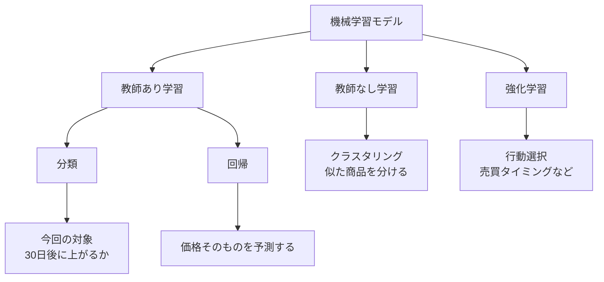
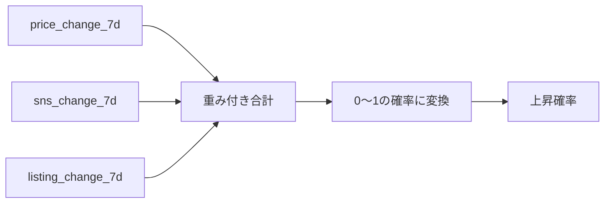
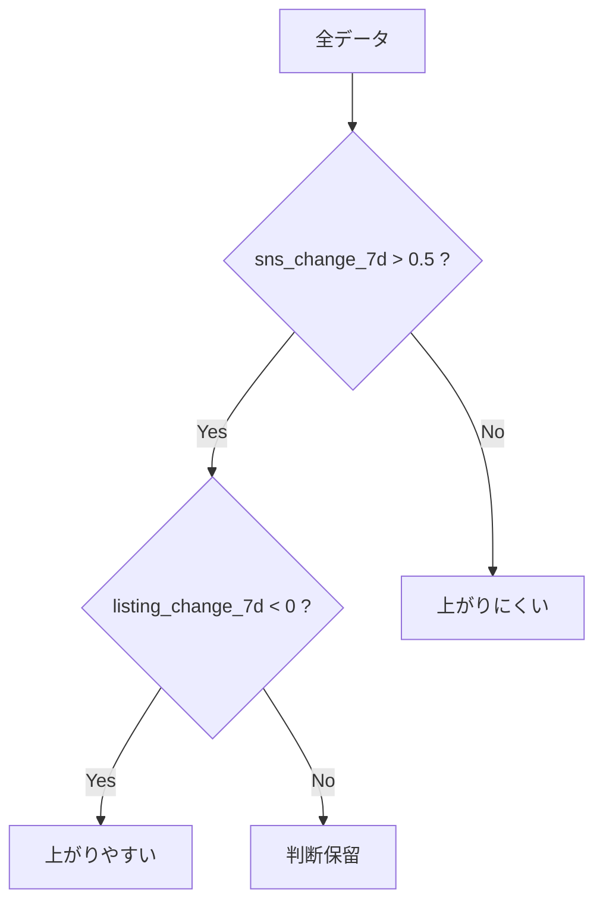
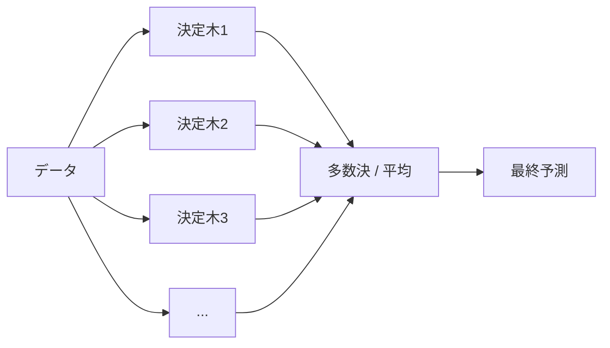
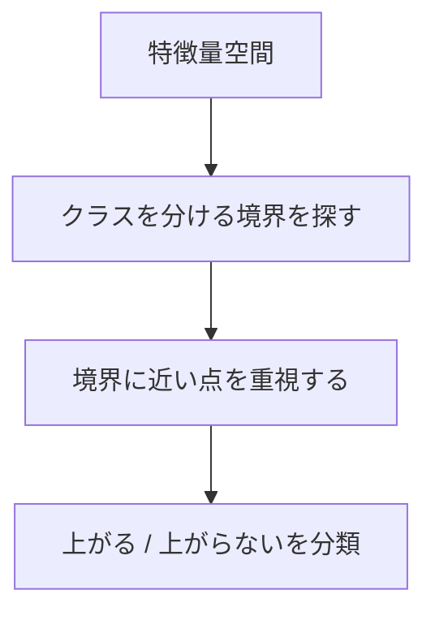
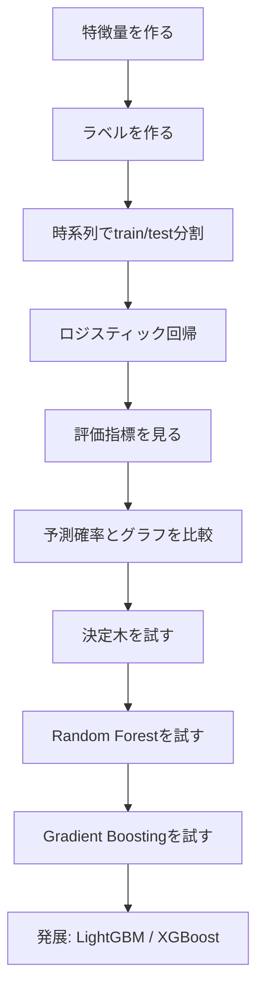
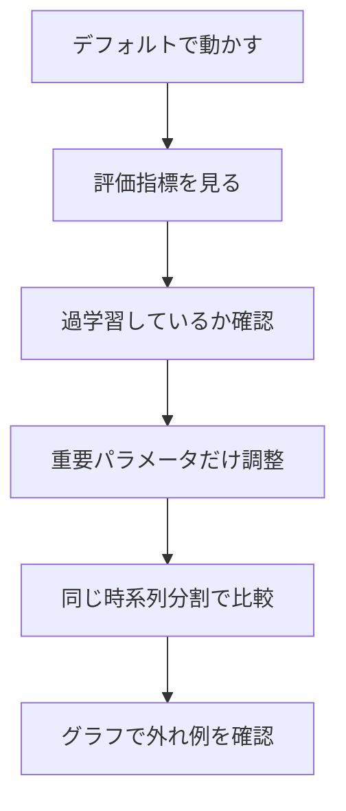

# 分類モデルの種類

作成日: 2026-07-05 JST

## このドキュメントの目的

今回の課題では、次の問いを予測する。

```text
30日後に価格が +30%以上 上がるか
```

これは、答えが `1` または `0` になる問題。

```text
上がる     -> 1
上がらない -> 0
```

このような問題は、機械学習では **分類問題** と呼ぶ。

このドキュメントでは、分類問題で使う代表的なモデルについて、初学者向けに整理する。

## モデルの全体像

機械学習モデルは、大きく分けると次のように整理できる。



今回の中心は、教師あり学習の中の **分類**。

## 今回の課題で使うモデル候補

| 優先度 | モデル | 位置づけ |
|---:|---|---|
| 1 | ロジスティック回帰 | 最初に使う基準モデル |
| 2 | 決定木 | 条件分岐を理解するためのモデル |
| 3 | Random Forest | 決定木を安定させたモデル |
| 4 | Gradient Boosting | 精度を上げやすい木系モデル |
| 5 | LightGBM / XGBoost | 実務でよく使われる発展モデル |
| 6 | SVM | 境界をうまく引くモデル |
| 7 | k近傍法 | 似ているデータから判断するモデル |
| 8 | ナイーブベイズ | テキスト分類などでよく使われる確率モデル |
| 9 | ニューラルネットワーク | 複雑な関係を学習できるモデル |

今回のおすすめ順は、以下。

```text
1. ロジスティック回帰
2. 決定木
3. Random Forest
4. Gradient Boosting
5. LightGBM / XGBoost
```

最初から高性能なモデルに行くより、まずはロジスティック回帰で、

```text
特徴量
↓
予測確率
↓
評価
↓
外れた理由の確認
```

の流れを理解する方が重要。

## モデル比較表

| モデル | 理解しやすさ | 精度の出やすさ | 解釈しやすさ | 今回の優先度 |
|---|---:|---:|---:|---:|
| ロジスティック回帰 | 高 | 中 | 高 | 高 |
| 決定木 | 高 | 中 | 中 | 中 |
| Random Forest | 中 | 高 | 中 | 中 |
| Gradient Boosting | 中 | 高 | 低〜中 | 中 |
| LightGBM / XGBoost | 低〜中 | 高 | 低〜中 | 発展 |
| SVM | 中 | 中〜高 | 低 | 低 |
| k近傍法 | 高 | 中 | 中 | 低 |
| ナイーブベイズ | 中 | 用途次第 | 中 | 低 |
| ニューラルネットワーク | 低 | データ次第 | 低 | 低 |

## 1. ロジスティック回帰

### 概要

ロジスティック回帰は、分類問題で使う基本的なモデル。

名前に「回帰」と入っているが、scikit-learnでは分類モデルとして扱われる。

今回のような二値分類では、

```text
30日後に上がる確率
```

を出せる。

### ざっくりした理論

ロジスティック回帰は、特徴量を重み付きで足し合わせる。

```text
スコア = 特徴量1 × 重み1 + 特徴量2 × 重み2 + ...
```

そのスコアを、0〜1の確率に変換する。

```text
スコア
↓
確率
↓
上がる / 上がらない
```

イメージ:



### 特徴

| 観点 | 内容 |
|---|---|
| 長所 | シンプル、予測確率が出る、係数を見て解釈しやすい |
| 短所 | 複雑な条件分岐や非線形な関係は苦手 |
| 向いている場面 | 最初の基準モデル、特徴量の効き方を見たいとき |
| 今回の使い方 | 最初に使うモデル |

### 今回の例

たとえば、学習後に次のような傾向を見る。

```text
sns_change_7d が大きいほど、上昇確率が上がる
listing_change_7d が大きいほど、上昇確率が下がる
```

このように、特徴量と予測の関係を理解しやすい。

### 参考

- scikit-learn LogisticRegression: https://scikit-learn.org/stable/modules/generated/sklearn.linear_model.LogisticRegression.html
- scikit-learn Linear Models: https://scikit-learn.org/stable/modules/linear_model.html

## 2. 決定木

### 概要

決定木は、条件分岐を重ねて予測するモデル。

たとえば、次のような判断をする。

```text
sns_change_7d > 0.5 ?
  yes -> listing_count が少ない ?
  no  -> 上がらない可能性が高い
```

### ざっくりした理論

データを、特徴量の条件で分けていく。



木の各分岐は、

```text
どの特徴量で分けると、ラベルがうまく分かれるか
```

を探して作られる。

### 特徴

| 観点 | 内容 |
|---|---|
| 長所 | 条件分岐として理解しやすい、非線形な関係を扱える |
| 短所 | 過学習しやすい、少しのデータ変化で木が変わることがある |
| 向いている場面 | ルールっぽい関係を見たいとき |
| 今回の使い方 | ロジスティック回帰の次に試す候補 |

### 今回の例

決定木は、次のような関係を拾いやすい。

```text
SNSが増えていて、出品数が減っていて、配布終了後なら上がりやすい
```

複数条件の組み合わせを見るのが得意。

### 参考

- scikit-learn Decision Trees: https://scikit-learn.org/stable/modules/tree.html

## 3. Random Forest

### 概要

Random Forestは、たくさんの決定木を作って、それらの予測を平均・多数決するモデル。

1本の決定木は不安定になりやすい。
そこで、複数の木を使って安定させる。

### ざっくりした理論



各決定木は、データや特徴量を少しずつ変えて作られる。

そのため、1本の木に依存しすぎない。

### 特徴

| 観点 | 内容 |
|---|---|
| 長所 | 決定木より安定しやすい、精度が出やすい、特徴量重要度を見られる |
| 短所 | ロジスティック回帰や単体の決定木より解釈しにくい |
| 向いている場面 | 表データでまず強めのモデルを試したいとき |
| 今回の使い方 | ロジスティック回帰後の比較モデル |

### 今回の例

Random Forestは、次のような複雑な組み合わせを拾いやすい。

```text
SNS増加
検索関心増加
出品数減少
イベント後
```

これらが組み合わさったときの価格上昇パターンを見るのに向く。

### 参考

- scikit-learn RandomForestClassifier: https://scikit-learn.org/stable/modules/generated/sklearn.ensemble.RandomForestClassifier.html
- scikit-learn Ensembles: https://scikit-learn.org/stable/modules/ensemble.html

## 4. Gradient Boosting

### 概要

Gradient Boostingは、弱いモデルを順番に作り、前のモデルの間違いを次のモデルが補正していく方法。

多くの場合、弱いモデルとして浅い決定木を使う。

### ざっくりした理論


Random Forestが「たくさんの木を並列に作る」イメージなら、
Gradient Boostingは「木を順番に積み上げる」イメージ。

### 特徴

| 観点 | 内容 |
|---|---|
| 長所 | 精度が出やすい、表データに強い |
| 短所 | パラメータ調整が必要、過学習に注意 |
| 向いている場面 | ベースラインより精度を上げたいとき |
| 今回の使い方 | Random Forestの後に試す候補 |

### 今回の例

ロジスティック回帰では拾いきれない、

```text
イベント後だけSNS増加の意味が変わる
出品数が一定以下のときだけ価格が上がりやすい
```

のような関係を拾える可能性がある。

### 参考

- scikit-learn GradientBoostingClassifier: https://scikit-learn.org/stable/modules/generated/sklearn.ensemble.GradientBoostingClassifier.html
- scikit-learn Ensembles: https://scikit-learn.org/stable/modules/ensemble.html

## 5. LightGBM / XGBoost

### 概要

LightGBMとXGBoostは、Gradient Boosting系の発展モデル。

どちらも、決定木をベースにした高性能なモデルとして、表データの実務でよく使われる。

### ざっくりした理論

基本はGradient Boostingと同じ。

```text
弱い木を順番に足していき、
前のモデルの間違いを次の木で補正する
```

LightGBMやXGBoostは、この処理を高速・高精度にするための工夫を多く持つ。

### 特徴

| 観点 | 内容 |
|---|---|
| 長所 | 表データで高精度が出やすい、実務でよく使われる |
| 短所 | パラメータが多い、解釈が難しくなりやすい |
| 向いている場面 | ベースライン構築後、精度改善したいとき |
| 今回の使い方 | 発展課題 |

### LightGBMとXGBoostの違い

| モデル | 特徴 |
|---|---|
| XGBoost | 高性能なGradient Boosting実装。安定して使われることが多い |
| LightGBM | 高速・省メモリを重視したGradient Boosting実装 |

### 今回の注意

最初からLightGBMやXGBoostを使うと、

```text
なぜ当たったのか
どの特徴量が効いたのか
どこで外れたのか
```

が分かりにくくなる。

今回の目的は学習なので、まずはロジスティック回帰から始める。

### 参考

- XGBoost Documentation: https://xgboost.readthedocs.io/
- XGBoost Introduction to Boosted Trees: https://xgboost.readthedocs.io/en/stable/tutorials/model.html
- LightGBM Documentation: https://lightgbm.readthedocs.io/
- LightGBM Features: https://lightgbm.readthedocs.io/en/latest/Features.html

## 6. SVM

### 概要

SVMは、クラスを分ける境界線をうまく引くモデル。

分類だけでなく、回帰や外れ値検出にも使われる。

### ざっくりした理論

2つのクラスを分ける境界を探す。

そのとき、境界から近いデータ点との距離がなるべく大きくなるようにする。



### 特徴

| 観点 | 内容 |
|---|---|
| 長所 | 高次元データに強いことがある、境界を柔軟に作れる |
| 短所 | 大きいデータでは重くなりやすい、確率解釈がやや弱い |
| 向いている場面 | 特徴量数が多い分類、境界が複雑な分類 |
| 今回の使い方 | 優先度は低め |

### 参考

- scikit-learn Support Vector Machines: https://scikit-learn.org/stable/modules/svm.html
- scikit-learn SVC: https://scikit-learn.org/stable/modules/generated/sklearn.svm.SVC.html

## 7. k近傍法

### 概要

k近傍法は、似ているデータを探して、多数決で分類するモデル。

英語では k-Nearest Neighbors、略して kNN。

### ざっくりした理論

予測したいデータに近い過去データを `k` 個探す。

その近くのデータが上がっていたら、今回も上がると判断する。


### 特徴

| 観点 | 内容 |
|---|---|
| 長所 | 直感的で分かりやすい、学習処理が単純 |
| 短所 | データが増えると予測が重い、特徴量のスケールに影響されやすい |
| 向いている場面 | 似たパターンを探したいとき、学習用 |
| 今回の使い方 | 優先度は低め |

### 今回の注意

`price` と `sns_mentions` のように値のスケールが違う特徴量を使う場合、標準化しないと距離計算が偏る。

### 参考

- scikit-learn Nearest Neighbors: https://scikit-learn.org/stable/modules/neighbors.html
- scikit-learn KNeighborsClassifier: https://scikit-learn.org/stable/modules/generated/sklearn.neighbors.KNeighborsClassifier.html

## 8. ナイーブベイズ

### 概要

ナイーブベイズは、確率を使って分類するモデル。

特徴量同士が独立している、という強い仮定を置く。

### ざっくりした理論

あるデータがクラスに属する確率を計算する。

```text
この特徴量の組み合わせなら、上がる確率はどれくらいか
```

を確率的に見る。

### 特徴

| 観点 | 内容 |
|---|---|
| 長所 | 速い、シンプル、少ないデータでも動きやすい |
| 短所 | 特徴量同士が独立という仮定が強い |
| 向いている場面 | テキスト分類、単語カウントなど |
| 今回の使い方 | 優先度は低め |

### 今回の注意

今回の特徴量は、

```text
price_change_7d
sns_change_7d
trends_change_7d
```

のように互いに関係していそうなものが多い。

そのため、ナイーブベイズは今回の中心にはしない。

### 参考

- scikit-learn Naive Bayes: https://scikit-learn.org/stable/modules/naive_bayes.html
- scikit-learn Naive Bayes API: https://scikit-learn.org/stable/api/sklearn.naive_bayes.html

## 9. ニューラルネットワーク

### 概要

ニューラルネットワークは、多層の計算構造を使って複雑な関係を学習するモデル。

scikit-learnでは `MLPClassifier` が代表。

### ざっくりした理論

入力特徴量を、複数の層で変換しながら予測する。


### 特徴

| 観点 | 内容 |
|---|---|
| 長所 | 複雑な関係を表現できる |
| 短所 | データ量が必要、調整が難しい、解釈しにくい |
| 向いている場面 | 大量データ、画像、音声、自然言語など |
| 今回の使い方 | 不要。発展でも優先度は低い |

### 今回の注意

今回のデータは学習用の小さな表データ。

ニューラルネットワークを使うより、ロジスティック回帰や木系モデルの方が学習目的に合っている。

### 参考

- scikit-learn MLPClassifier: https://scikit-learn.org/stable/modules/generated/sklearn.neural_network.MLPClassifier.html

## モデルの選び方

### 最初は基準モデルを作る

最初から高性能なモデルを使うより、シンプルなモデルを作る。

理由:

- バグに気づきやすい
- 特徴量と予測の関係を理解しやすい
- 後で複雑なモデルと比較できる

今回の基準モデル:

```text
ロジスティック回帰
```

### 精度を上げたいとき

ロジスティック回帰で一通り流れができたら、木系モデルを試す。

```text
決定木
↓
Random Forest
↓
Gradient Boosting
↓
LightGBM / XGBoost
```

### 解釈を重視したいとき

| 重視すること | 候補 |
|---|---|
| 係数で見たい | ロジスティック回帰 |
| 条件分岐で見たい | 決定木 |
| 重要特徴量を見たい | Random Forest, Gradient Boosting |

### 精度を重視したいとき

| 状況 | 候補 |
|---|---|
| 表データで精度を上げたい | Random Forest, Gradient Boosting |
| さらに実務的に試したい | LightGBM, XGBoost |
| データが非常に多い | LightGBM, XGBoost |

## 今回のおすすめ実行順



### 1. ロジスティック回帰

最初に使う。

目的:

- モデル学習の流れを理解する
- 予測確率を出す
- 特徴量の係数を見る

### 2. 決定木

次に試す。

目的:

- 条件分岐としてモデルを理解する
- どの条件で上がりやすいか見る

### 3. Random Forest

決定木の次に試す。

目的:

- 単体の決定木より安定した予測を見る
- feature importanceを見る

### 4. Gradient Boosting

さらに精度を見たい場合に試す。

目的:

- 木系モデルで精度がどれくらい上がるか見る

### 5. LightGBM / XGBoost

発展課題。

目的:

- 実務でよく使われる表データ向けモデルを体験する

## モデル別の設計ポイントと調整パラメータ

ここでは、各モデルを使うときに設計者が考えるべきことを整理する。

機械学習では、モデルが学習して決める値と、人間が事前に決める値を分けて考える。

| 種類 | 意味 | 例 |
|---|---|---|
| パラメータ | モデルが学習で決める値 | ロジスティック回帰の係数、決定木の分岐条件 |
| ハイパーパラメータ | 人間が事前に決める値 | 木の深さ、正則化の強さ、木の本数 |

この章で扱うのは、主に **ハイパーパラメータ**。

### 調整の基本方針

最初から大量のパラメータを調整しない。

まずは、次の順番で考える。

```text
1. デフォルト設定で動かす
2. 評価指標を見る
3. 過学習しているか確認する
4. 重要なパラメータだけ少し変える
5. 同じ評価方法で比較する
```

今回のような時系列データでは、ランダム分割ではなく、時系列分割で比較する。

```text
過去データで学習
未来データで評価
```

## 1. ロジスティック回帰の設計ポイント

### 設計者が考えること

| 観点 | 考えること |
|---|---|
| 特徴量のスケール | 標準化するか |
| 正則化 | 過学習を抑える強さをどうするか |
| ペナルティ | L1 / L2 / Elastic Net のどれを使うか |
| solver | 選んだペナルティに対応するsolverを使うか |
| クラス不均衡 | 正例が少ない場合に `class_weight` を使うか |

### 主な調整パラメータ

| パラメータ | 意味 | 調整の方向 |
|---|---|---|
| `C` | 正則化の強さの逆数 | 小さいほど正則化が強い。大きいほど学習データに合わせやすい |
| `penalty` | 正則化の種類 | 最初は `l2` でよい |
| `solver` | 最適化アルゴリズム | `penalty` との対応に注意 |
| `class_weight` | クラス不均衡への重み | 正例が少ないなら `balanced` を試す |
| `max_iter` | 最大反復回数 | 収束警告が出たら増やす |

### 今回の推奨

最初は、深く調整しすぎない。

```text
標準化あり
penalty = l2
C = 1.0
class_weight = なし、または balanced を比較
```

見るべきこと:

- 予測確率が出ているか
- precision / recall がどう変わるか
- 係数の符号が直感と合うか

### 注意点

ロジスティック回帰は、特徴量のスケールの影響を受けやすい。

たとえば、`price` と `sns_change_7d` では値の大きさが違う。
そのため、係数を解釈するなら標準化を前提にした方がよい。

参考:

- scikit-learn LogisticRegression: https://scikit-learn.org/stable/modules/generated/sklearn.linear_model.LogisticRegression.html
- scikit-learn LogisticRegressionCV: https://scikit-learn.org/stable/modules/generated/sklearn.linear_model.LogisticRegressionCV.html

## 2. 決定木の設計ポイント

### 設計者が考えること

| 観点 | 考えること |
|---|---|
| 木の深さ | 複雑にしすぎないか |
| 葉の最小サンプル数 | 少数データだけで分岐していないか |
| 分岐基準 | `gini` か `entropy` か |
| 過学習 | 学習データに合わせすぎていないか |

### 主な調整パラメータ

| パラメータ | 意味 | 調整の方向 |
|---|---|---|
| `max_depth` | 木の最大深さ | 小さいほど単純。大きいほど複雑 |
| `min_samples_split` | 分岐に必要な最小サンプル数 | 大きいほど分岐しにくい |
| `min_samples_leaf` | 葉に必要な最小サンプル数 | 大きいほど過学習しにくい |
| `max_leaf_nodes` | 葉の最大数 | 木全体の複雑さを制限する |
| `criterion` | 分岐の評価基準 | 最初は `gini` でよい |
| `class_weight` | クラス不均衡への重み | 正例が少ないなら比較する |

### 今回の推奨

決定木は過学習しやすい。

最初は浅い木で試す。

```text
max_depth = 3〜5
min_samples_leaf = 5 以上
```

見るべきこと:

- 条件分岐が人間に理解できるか
- 学習データだけ極端に高精度になっていないか
- テスト期間でも同じ傾向があるか

### 注意点

`max_depth=None` のままだと、木が深くなりすぎることがある。
scikit-learnのDecision Treeドキュメントでも、木のサイズを制御して過学習を防ぐことが重要とされている。

参考:

- scikit-learn DecisionTreeClassifier: https://scikit-learn.org/stable/modules/generated/sklearn.tree.DecisionTreeClassifier.html
- scikit-learn Decision Trees: https://scikit-learn.org/stable/modules/tree.html

## 3. Random Forestの設計ポイント

### 設計者が考えること

| 観点 | 考えること |
|---|---|
| 木の本数 | 安定性と計算時間のバランス |
| 各木の深さ | 1本1本を複雑にしすぎないか |
| 特徴量サンプリング | 木ごとに使う特徴量をどれくらい変えるか |
| クラス不均衡 | 正例が少ない場合の重み付け |
| 再現性 | `random_state` を固定するか |

### 主な調整パラメータ

| パラメータ | 意味 | 調整の方向 |
|---|---|---|
| `n_estimators` | 木の本数 | 多いほど安定しやすいが遅くなる |
| `max_depth` | 各木の最大深さ | 深いほど複雑 |
| `min_samples_leaf` | 葉に必要な最小サンプル数 | 大きいほど過学習しにくい |
| `max_features` | 各分岐で見る特徴量数 | 小さいほど木の多様性が増える |
| `bootstrap` | 復元抽出するか | 通常は `True` |
| `class_weight` | クラス不均衡への重み | 正例が少ないなら比較する |
| `random_state` | 乱数固定 | 比較実験では固定する |

### 今回の推奨

まずは、ロジスティック回帰の比較対象として使う。

```text
n_estimators = 100〜300
max_depth = 3〜8
min_samples_leaf = 5 以上
random_state = 固定
```

見るべきこと:

- ロジスティック回帰より評価指標が改善するか
- feature importanceで上位に来る特徴量が直感と合うか
- 過学習していないか

### 注意点

Random Forestは、単体の決定木より安定しやすい。
ただし、モデル全体の解釈は少し難しくなる。

参考:

- scikit-learn RandomForestClassifier: https://scikit-learn.org/stable/modules/generated/sklearn.ensemble.RandomForestClassifier.html
- scikit-learn Ensembles: https://scikit-learn.org/stable/modules/ensemble.html

## 4. Gradient Boostingの設計ポイント

### 設計者が考えること

| 観点 | 考えること |
|---|---|
| 学習率 | 1本ずつどれくらい強く補正するか |
| 木の本数 | 何段階補正するか |
| 各木の深さ | 1本の木をどれくらい複雑にするか |
| サンプリング | データの一部を使って過学習を抑えるか |
| 早期停止 | 改善しなくなったら止めるか |

### 主な調整パラメータ

| パラメータ | 意味 | 調整の方向 |
|---|---|---|
| `learning_rate` | 各木の影響度 | 小さいほど慎重。通常は `n_estimators` とセットで調整 |
| `n_estimators` | 木を積み上げる回数 | 多いほど学習が進むが過学習に注意 |
| `max_depth` | 各木の深さ | 深いほど複雑 |
| `min_samples_leaf` | 葉に必要な最小サンプル数 | 大きいほど過学習しにくい |
| `subsample` | 各段階で使うサンプル割合 | 1未満にするとばらつきが入り、過学習抑制になることがある |
| `validation_fraction` | 早期停止用の検証割合 | `n_iter_no_change` と一緒に使う |
| `n_iter_no_change` | 改善しない反復が続いたら止める | 過学習や無駄な学習を抑える |

### 今回の推奨

最初は、複雑にしすぎない。

```text
learning_rate = 0.05〜0.1
n_estimators = 100〜300
max_depth = 2〜3
min_samples_leaf = 5 以上
```

見るべきこと:

- Random Forestより改善するか
- precisionだけでなくrecallも落ちていないか
- 学習期間にだけ強く合っていないか

### 注意点

`learning_rate` と `n_estimators` はトレードオフがある。
scikit-learn公式ドキュメントでも、`learning_rate` は各木の寄与を縮小し、`n_estimators` とトレードオフになると説明されている。

参考:

- scikit-learn GradientBoostingClassifier: https://scikit-learn.org/stable/modules/generated/sklearn.ensemble.GradientBoostingClassifier.html
- scikit-learn Ensembles: https://scikit-learn.org/stable/modules/ensemble.html

## 5. LightGBM / XGBoostの設計ポイント

LightGBMとXGBoostは、どちらもGradient Boosting系の発展モデル。

共通して重要なのは、次の3つ。

```text
木の複雑さ
学習率と木の本数
サンプリングと正則化
```

### XGBoostの主な調整パラメータ

| パラメータ | 意味 | 調整の方向 |
|---|---|---|
| `learning_rate` / `eta` | 各木の影響度 | 小さいほど慎重。木の本数とセットで調整 |
| `n_estimators` | 木の本数 | 多いほど学習が進む |
| `max_depth` | 木の最大深さ | 深いほど複雑 |
| `min_child_weight` | 子ノードに必要な重み | 大きいほど保守的 |
| `subsample` | 行サンプリング割合 | 小さくすると過学習抑制になることがある |
| `colsample_bytree` | 木ごとに使う特徴量割合 | 小さくすると過学習抑制になることがある |
| `reg_alpha` | L1正則化 | 大きいほど特徴量を絞りやすい |
| `reg_lambda` | L2正則化 | 大きいほど重みを抑える |
| `eval_metric` | 評価指標 | `logloss`, `auc` など |

### LightGBMの主な調整パラメータ

| パラメータ | 意味 | 調整の方向 |
|---|---|---|
| `learning_rate` | 各木の影響度 | 小さいほど慎重 |
| `n_estimators` / `num_iterations` | 木の本数 | 多いほど学習が進む |
| `num_leaves` | 葉の最大数 | 大きいほど複雑。LightGBMで特に重要 |
| `max_depth` | 木の最大深さ | 深さを明示的に制限する |
| `min_data_in_leaf` | 葉に必要な最小データ数 | 大きいほど過学習しにくい |
| `feature_fraction` | 特徴量サンプリング割合 | 小さくすると過学習抑制になることがある |
| `bagging_fraction` | 行サンプリング割合 | `bagging_freq` と一緒に使う |
| `lambda_l1` | L1正則化 | 大きいほど特徴量を絞りやすい |
| `lambda_l2` | L2正則化 | 大きいほど重みを抑える |

### 今回の推奨

今回の初期段階では、まだ使わなくてよい。

使うなら、ロジスティック回帰、決定木、Random Forest、Gradient Boostingまで終わった後。

設計ポイント:

- 最初からパラメータを大量に触らない
- `learning_rate` と木の本数をセットで見る
- 木の複雑さを `max_depth`, `num_leaves`, `min_child_weight`, `min_data_in_leaf` で抑える
- 時系列分割で評価する

### 注意点

LightGBM公式ドキュメントでは、`num_leaves` は木の複雑さを制御する主要パラメータとされている。
また、`num_leaves` は単純に `2^(max_depth)` にすればよいわけではなく、過学習に注意が必要。

XGBoost公式ドキュメントでは、`colsample_bytree` などの列サンプリング系パラメータが、木ごとに使う特徴量の割合を制御する。

参考:

- XGBoost Parameters: https://xgboost.readthedocs.io/en/stable/parameter.html
- XGBoost Introduction to Boosted Trees: https://xgboost.readthedocs.io/en/stable/tutorials/model.html
- LightGBM Parameters: https://lightgbm.readthedocs.io/en/latest/Parameters.html
- LightGBM Parameters Tuning: https://lightgbm.readthedocs.io/en/latest/Parameters-Tuning.html
- LightGBM Python API: https://lightgbm.readthedocs.io/en/latest/pythonapi/lightgbm.LGBMModel.html

## 6. SVMの設計ポイント

### 設計者が考えること

| 観点 | 考えること |
|---|---|
| kernel | 線形境界か、非線形境界か |
| C | 誤分類をどれくらい許すか |
| gamma | RBF kernelで1つの点の影響範囲をどうするか |
| スケーリング | 特徴量を標準化するか |
| データ量 | サンプル数が多すぎないか |

### 主な調整パラメータ

| パラメータ | 意味 | 調整の方向 |
|---|---|---|
| `kernel` | 境界の作り方 | 最初は `linear` か `rbf` |
| `C` | 誤分類への罰則 | 大きいほど訓練データに合わせる |
| `gamma` | RBFの影響範囲 | 大きいほど局所的で複雑 |
| `class_weight` | クラス不均衡への重み | 正例が少ないなら比較する |
| `probability` | 確率出力するか | `True` にすると遅くなる |

### 今回の推奨

今回の優先度は低い。

使う場合は、必ず特徴量を標準化する。

```text
kernel = linear または rbf
C と gamma を少数候補で比較
```

### 注意点

scikit-learn公式ドキュメントでは、SVCのfit時間はサンプル数に対して少なくとも二乗程度にスケールするため、大きなデータでは実用的でない場合があると説明されている。

また、RBF kernelでは `C` と `gamma` が重要。
`C` は誤分類と境界の単純さのトレードオフ、`gamma` は1つの訓練例が影響する範囲を制御する。

参考:

- scikit-learn SVC: https://scikit-learn.org/stable/modules/generated/sklearn.svm.SVC.html
- scikit-learn Support Vector Machines: https://scikit-learn.org/stable/modules/svm.html
- scikit-learn RBF SVM parameters: https://scikit-learn.org/stable/auto_examples/svm/plot_rbf_parameters.html

## 7. k近傍法の設計ポイント

### 設計者が考えること

| 観点 | 考えること |
|---|---|
| 近傍数 | 何個の近いデータを見るか |
| 距離 | 何を「近い」とみなすか |
| 重み | 近い点を強く見るか |
| スケーリング | 距離計算のために標準化するか |

### 主な調整パラメータ

| パラメータ | 意味 | 調整の方向 |
|---|---|---|
| `n_neighbors` | 近くを見るデータ数 | 小さいほど局所的。大きいほどなめらか |
| `weights` | 近傍の重み | `uniform` または `distance` |
| `metric` | 距離の測り方 | 最初は `minkowski` でよい |
| `p` | Minkowski距離の種類 | `p=2` はユークリッド距離 |

### 今回の推奨

優先度は低い。

使うなら、必ず標準化する。

```text
n_neighbors = 3, 5, 10 などを比較
weights = uniform / distance を比較
```

### 注意点

k近傍法は距離で判断するため、特徴量のスケールに強く影響される。

たとえば、`price` の値が大きいと、`sns_change_7d` より距離計算に強く効いてしまう。

参考:

- scikit-learn KNeighborsClassifier: https://scikit-learn.org/stable/modules/generated/sklearn.neighbors.KNeighborsClassifier.html
- scikit-learn Nearest Neighbors: https://scikit-learn.org/stable/modules/neighbors.html

## 8. ナイーブベイズの設計ポイント

### 設計者が考えること

| 観点 | 考えること |
|---|---|
| 分布の種類 | 特徴量に合ったNaive Bayesを選ぶ |
| スムージング | 出現しない値への対処をどうするか |
| 事前確率 | クラス比率を学習するか、指定するか |

### 主な調整パラメータ

| モデル | パラメータ | 意味 |
|---|---|---|
| `MultinomialNB` | `alpha` | 加法スムージング |
| `MultinomialNB` | `fit_prior` | クラス事前確率を学習するか |
| `GaussianNB` | `var_smoothing` | 分散に加える安定化項 |

### 今回の推奨

今回の中心にはしない。

理由:

- 今回は時系列由来の連続値特徴量が多い
- 特徴量同士が独立とは考えにくい
- テキスト分類のような典型用途ではない

試すなら、あくまで比較用。

### 参考

- scikit-learn Naive Bayes: https://scikit-learn.org/stable/modules/naive_bayes.html
- scikit-learn MultinomialNB: https://scikit-learn.org/stable/modules/generated/sklearn.naive_bayes.MultinomialNB.html
- scikit-learn GaussianNB: https://scikit-learn.org/stable/modules/generated/sklearn.naive_bayes.GaussianNB.html

## 9. ニューラルネットワークの設計ポイント

### 設計者が考えること

| 観点 | 考えること |
|---|---|
| 層の数と幅 | モデルの表現力をどれくらいにするか |
| 活性化関数 | 非線形変換をどうするか |
| 正則化 | 過学習をどう抑えるか |
| 学習率 | 重み更新の大きさをどうするか |
| 最大反復回数 | どれくらい学習させるか |
| スケーリング | 特徴量を標準化するか |

### 主な調整パラメータ

| パラメータ | 意味 | 調整の方向 |
|---|---|---|
| `hidden_layer_sizes` | 隠れ層の数とユニット数 | 大きいほど複雑 |
| `activation` | 活性化関数 | 最初は `relu` でよい |
| `solver` | 最適化手法 | 小規模なら `lbfgs`、一般には `adam` など |
| `alpha` | L2正則化 | 大きいほど過学習を抑える |
| `learning_rate_init` | 初期学習率 | 大きすぎると不安定、小さすぎると遅い |
| `max_iter` | 最大反復回数 | 収束しなければ増やす |
| `early_stopping` | 早期停止 | 過学習抑制に使える |

### 今回の推奨

今回の初期段階では不要。

ニューラルネットワークは、

- データ量が多い
- 非常に複雑な関係を学習したい
- 調整や検証に時間をかけられる

という場合に検討する。

今回のような小さな表データでは、ロジスティック回帰や木系モデルの方が学習目的に合う。

### 注意点

MLPは特徴量スケールの影響を受けやすい。
使うなら標準化を前提にする。

参考:

- scikit-learn MLPClassifier: https://scikit-learn.org/stable/modules/generated/sklearn.neural_network.MLPClassifier.html
- scikit-learn Neural network models: https://scikit-learn.org/stable/modules/neural_networks_supervised.html

## 今回のパラメータ調整のおすすめ順

今回の課題では、パラメータ調整も段階的に行う。



### Step 1: ロジスティック回帰

まず比較するのは少数でよい。

| 比較するもの | 理由 |
|---|---|
| `C` | 正則化の強さを見る |
| `class_weight` | 正例が少ない問題への影響を見る |

### Step 2: 決定木

| 比較するもの | 理由 |
|---|---|
| `max_depth` | 木の複雑さを制御する |
| `min_samples_leaf` | 少数例への過剰適合を防ぐ |

### Step 3: Random Forest

| 比較するもの | 理由 |
|---|---|
| `n_estimators` | 予測の安定性を見る |
| `max_depth` | 各木の複雑さを抑える |
| `min_samples_leaf` | 過学習を抑える |

### Step 4: Gradient Boosting

| 比較するもの | 理由 |
|---|---|
| `learning_rate` | 1本あたりの補正の強さ |
| `n_estimators` | 補正回数 |
| `max_depth` | 各木の複雑さ |

### Step 5: LightGBM / XGBoost

発展として試す。

| 比較するもの | 理由 |
|---|---|
| `learning_rate` | 学習の慎重さ |
| `n_estimators` | 木の本数 |
| `max_depth` / `num_leaves` | 木の複雑さ |
| `subsample` / `bagging_fraction` | 行サンプリング |
| `colsample_bytree` / `feature_fraction` | 特徴量サンプリング |

## パラメータ調整時の注意点

### 1. テストデータに合わせて調整しすぎない

テストデータを見ながら何度も調整すると、テストデータに対して都合のよいモデルになる。

本来は、次の3つに分けるのが理想。

```text
train
validation
test
```

今回の学習段階では、まずは時系列分割を守ることを優先する。

### 2. 一度に多くのパラメータを触らない

一度に多く触ると、何が効いたのか分からなくなる。

最初は、モデルごとに2〜3個だけ調整する。

### 3. 評価指標を固定する

毎回違う指標を見ると比較できない。

今回なら、最低限以下を見る。

```text
accuracy
precision
recall
confusion matrix
ROC-AUC
```

特に、候補として出した商品の当たり率を見るなら `precision` が重要。

### 4. 再現性を確保する

乱数を使うモデルでは `random_state` を固定する。

対象例:

- Random Forest
- Gradient Boosting
- LightGBM
- XGBoost
- ニューラルネットワーク

## 評価時に見るもの

モデルを変えたら、必ず同じ評価指標で比較する。

| 指標 | 意味 |
|---|---|
| accuracy | 全体でどれくらい当たったか |
| precision | 上がると予測したもののうち、本当に上がった割合 |
| recall | 実際に上がったものをどれくらい拾えたか |
| confusion matrix | 当たり外れの内訳 |
| ROC-AUC | 確率予測の分離性能 |

今回特に重要なのは `precision`。

理由:

```text
上がると予測した候補が外れすぎると、
判断材料として信用しにくいため
```

ただし、precisionだけを見ると、候補をほとんど出さないモデルになることがある。

そのため、precisionとrecallのバランスを見る。

## 注意点

### 1. 架空データの高精度を過信しない

今回のデータは学習用の架空データ。

高精度が出ても、本番で当たるとは限らない。

確認するのは、次の流れ。

```text
特徴量を作る
ラベルを作る
モデルを学習する
予測確率を出す
評価する
グラフで確認する
```

### 2. 未来情報を入れない

特徴量には、予測時点より未来の情報を入れない。

例:

```text
2025-02-01に予測するなら、
2025-02-02以降のpriceやsns_mentionsは特徴量に入れない。
```

### 3. モデルより先に特徴量とラベルが重要

モデルを変える前に、まず確認すること:

- 特徴量は正しく作れているか
- ラベルは正しく作れているか
- train/test分割で未来情報が混ざっていないか
- 評価指標を正しく見ているか

モデルだけ高性能にしても、特徴量やラベルが間違っていると意味がない。

## まとめ

今回の課題では、最初に使うモデルはロジスティック回帰でよい。

理由:

- シンプル
- 予測確率が出る
- 係数を見て特徴量との関係を理解しやすい
- 最初の基準モデルとして使いやすい

その後、次の順に試す。

```text
ロジスティック回帰
↓
決定木
↓
Random Forest
↓
Gradient Boosting
↓
LightGBM / XGBoost
```

最初の目的は、精度を最大化することではない。

```text
特徴量
↓
ラベル
↓
モデル
↓
予測確率
↓
評価
```

の流れを理解することが最優先。

## 参考リンク

- scikit-learn Supervised Learning: https://scikit-learn.org/stable/supervised_learning.html
- scikit-learn User Guide: https://scikit-learn.org/stable/user_guide.html
- scikit-learn LogisticRegression: https://scikit-learn.org/stable/modules/generated/sklearn.linear_model.LogisticRegression.html
- scikit-learn Decision Trees: https://scikit-learn.org/stable/modules/tree.html
- scikit-learn RandomForestClassifier: https://scikit-learn.org/stable/modules/generated/sklearn.ensemble.RandomForestClassifier.html
- scikit-learn GradientBoostingClassifier: https://scikit-learn.org/stable/modules/generated/sklearn.ensemble.GradientBoostingClassifier.html
- scikit-learn Support Vector Machines: https://scikit-learn.org/stable/modules/svm.html
- scikit-learn Nearest Neighbors: https://scikit-learn.org/stable/modules/neighbors.html
- scikit-learn Naive Bayes: https://scikit-learn.org/stable/modules/naive_bayes.html
- scikit-learn MLPClassifier: https://scikit-learn.org/stable/modules/generated/sklearn.neural_network.MLPClassifier.html
- XGBoost Documentation: https://xgboost.readthedocs.io/
- XGBoost Parameters: https://xgboost.readthedocs.io/en/stable/parameter.html
- LightGBM Documentation: https://lightgbm.readthedocs.io/
- LightGBM Parameters: https://lightgbm.readthedocs.io/en/latest/Parameters.html
- LightGBM Parameters Tuning: https://lightgbm.readthedocs.io/en/latest/Parameters-Tuning.html
