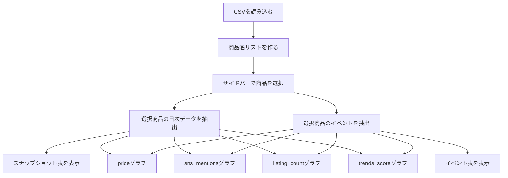

# Streamlitグラフ実装レビュー

対象: `src/app.py`

レビュー作成日時: 2026-07-03 23:19:46 JST

修正確認日時: 2026-07-03 23:19:46 JST

目的: 商品ごとの時系列データをStreamlitで確認できるようにする

確認した機能:

- 商品選択
- `price` の折れ線グラフ
- `sns_mentions` の折れ線グラフ
- `trends_score` の折れ線グラフ
- `listing_count` の折れ線グラフ
- イベント日の表示
- 選択商品の元データ表

## 全体評価

今回の実装は、課題の「データを読み込む」「グラフで確認する」段階として、方向性は適切です。

特に良い点は、以下です。

| 観点 | 評価 |
|---|---|
| 商品選択 | サイドバーで商品を切り替えられる |
| データ確認 | 選択商品のスナップショットとイベントを表で見られる |
| グラフ | 主要な時系列指標を折れ線グラフで確認できる |
| イベント表示 | イベント日を縦線として重ねられる |
| 関数分割 | CSV読み込み、商品抽出、イベント抽出、グラフ作成が分かれている |

この段階の目的は、モデルを作ることではなく、まずデータの動きを目で確認することです。
その意味で、現在の実装は次のステップへ進める状態です。

## 修正サマリ

| No. | 修正箇所 | 修正内容 | 理由 |
|---:|---|---|---|
| 1 | CSVパス | 相対パスから `Path(__file__)` 基準のパスへ変更 | 実行場所に依存せずCSVを読めるようにするため |
| 2 | CSV読み込み | `parse_dates` を受け取れるように変更 | `date` を文字列ではなく日付として扱うため |
| 3 | Streamlit表示 | `use_container_width=True` を `width="stretch"` に変更 | Streamlit 1.58で非推奨警告が出るため |
| 4 | 未使用import | `PlotlyState` importを削除 | 使っていない型を残さないため |
| 5 | 型チェック | `basedpyright` をdev依存に追加 | エディタとターミナルで同じ型チェックを再現するため |
| 6 | 型チェック設定 | `pyrightconfig.json` を調整 | Streamlit / Plotly / pandas の型警告を現実的に扱うため |

## 1. CSVパスの修正

### 修正前の考え方

```text
./data_source/daily_snapshots.csv
./data_source/events.csv
```

この書き方は、現在の作業ディレクトリを基準にファイルを探します。

つまり、次のように実行した場合に問題が起きます。

```bash
uv run streamlit run src/app.py
```

このコマンドはプロジェクト直下から実行するため、`./data_source/...` は次の場所を探します。

```text
collectible-prediction-sandbox/data_source/daily_snapshots.csv
```

しかし実際のCSVはここにあります。

```text
collectible-prediction-sandbox/src/data_source/daily_snapshots.csv
```

そのため、実行ディレクトリによっては `FileNotFoundError` になります。

### 修正後の考え方

```text
src/app.py の場所
↓
src/data_source
↓
daily_snapshots.csv
```

`Path(__file__).parent` を使うことで、常に `src/app.py` が置かれているディレクトリを基準にできます。

### なぜこの修正が重要か

アプリは、実行する人や実行方法によって作業ディレクトリが変わることがあります。

| 実行方法 | 作業ディレクトリ |
|---|---|
| `uv run streamlit run src/app.py` | プロジェクト直下 |
| エディタのRunボタン | エディタ設定次第 |
| テストやCI | 設定次第 |

ファイルパスをスクリプト基準にしておくと、これらの違いに強くなります。

## 2. 日付型変換の追加

### 修正内容

CSV読み込み関数に `parse_dates` を渡せるようにしました。

対象カラム:

- `daily_snapshots.csv` の `date`
- `events.csv` の `date`

### なぜ必要か

時系列グラフでは、日付を文字列として扱うより、日付型として扱う方が安全です。

| 文字列のまま | 日付型 |
|---|---|
| 並び順が文字列基準になる可能性がある | 日付として正しく並ぶ |
| グラフ軸の扱いが曖昧 | 時系列軸として扱いやすい |
| イベント日との比較が弱い | 縦線や範囲指定に使いやすい |

今回のデータは `YYYY-MM-DD` 形式なので文字列でも見かけ上は並びます。
ただし、今後の特徴量作成や期間フィルタを考えると、読み込み時点で日付型にしておく方がよいです。

## 3. Streamlit APIの更新

### 修正前

```text
st.plotly_chart(..., use_container_width=True)
```

### 修正後

```text
st.plotly_chart(..., width="stretch")
```

### なぜ修正したか

Streamlit 1.58では、`use_container_width` に非推奨警告が出ます。

警告の意味は、将来のバージョンでこの引数が削除される予定なので、新しい書き方に移行してください、というものです。

| 目的 | 古い書き方 | 新しい書き方 |
|---|---|---|
| 横幅いっぱいに表示 | `use_container_width=True` | `width="stretch"` |
| 内容に合わせて表示 | `use_container_width=False` | `width="content"` |

今回はグラフをカラム幅いっぱいに表示したいので、`width="stretch"` が適切です。

## 4. 未使用importの削除

### 修正内容

使われていなかった `PlotlyState` の import を削除しました。

### なぜ必要か

未使用importは、アプリの動作を壊すものではありません。
ただし、残しておくと次の問題があります。

- 何に使う予定なのか分かりにくい
- 型チェックで警告が出る
- 後から読む人が不要な依存を追ってしまう

コードは「今必要なものだけが残っている」状態の方が読みやすいです。

## 5. basedpyrightをdev依存に追加

### 修正内容

`pyproject.toml` のdev依存に `basedpyright` を追加しました。

### なぜ必要か

これまでは、エディタ上でbasedpyrightの警告は見えていましたが、ターミナルから同じ診断を再現できませんでした。

追加後は、次のコマンドで確認できます。

```bash
uv run basedpyright src/app.py
```

これにより、以下がやりやすくなります。

- 修正後に警告が消えたか確認する
- エディタとCLIで同じ基準に揃える
- 将来、CIで型チェックを実行しやすくする

## 6. 型チェック設定の調整

### 修正内容

`pyrightconfig.json` に以下の設定を追加しています。

| 設定 | 目的 |
|---|---|
| `reportUnusedCallResult: none` | Streamlit表示関数の戻り値未使用警告を抑える |
| `reportMissingTypeStubs: none` | Plotlyなど型スタブがないライブラリの警告を抑える |
| `reportUnknownMemberType: none` | `plotly.express` のような型情報が薄いAPIの警告を抑える |

### なぜ抑制が必要か

StreamlitやPlotlyは、Pythonの動的な書き方を多く使うライブラリです。
そのため、型チェッカーが完全には型を推論できないことがあります。

今回の目的は、型チェックで学習を止めることではなく、実装と理解を進めることです。
そのため、ライブラリ由来のノイズは抑え、こちらのコードで直すべき警告に集中できるようにしました。

## 処理の流れ

現在のアプリの流れは、次のように整理できます。



重要なのは、グラフの元になる日次データと、縦線の元になるイベントデータを分けて扱っている点です。

```text
daily_snapshots.csv
  -> 折れ線グラフの線

events.csv
  -> グラフ上の縦線・注釈
```

この分離は良い設計です。
価格やSNSの推移と、イベントというきっかけを別データとして管理できるからです。

## 今回の確認結果

実行した確認:

| コマンド | 結果 |
|---|---|
| `uv run basedpyright src/app.py` | `0 errors, 0 warnings, 0 notes` |
| `uv run python -m py_compile src/app.py` | 成功 |
| `uv run streamlit run src/app.py --server.headless true --server.port 8502` | 起動成功 |
| `curl -I http://localhost:8502` | `HTTP/1.1 200 OK` |

## 学習ポイント

今回の修正から学べることは、主に次の4つです。

### 1. ファイルパスは実行場所に依存させない

相対パスは便利ですが、どこから実行するかで意味が変わります。

アプリ内のデータファイルを読む場合は、スクリプト基準のパスにすると安定します。

### 2. 日付は早めに日付型へ変換する

時系列データでは、`date` は単なる文字列ではなく、分析の軸です。

読み込み時点で日付型にしておくと、後のグラフ、特徴量作成、期間分割が楽になります。

### 3. ライブラリの警告と自分のコードの警告を分ける

型チェックの警告には、次の2種類があります。

| 種類 | 対応 |
|---|---|
| 自分のコードの不備 | コードを直す |
| ライブラリの型情報不足 | 設定で抑えることも検討する |

全部を無理にコードで直そうとすると、かえって読みにくくなることがあります。

### 4. グラフは「問い」を持って見る

今回のグラフは、ただ表示するだけではなく、次の問いを見るためのものです。

- SNS言及数は価格より先に上がっているか
- 検索関心が上がった後に価格は上がっているか
- 出品数が増えた後に価格は下がっているか
- イベント後に価格や出品数は変わっているか

この観察が、次の特徴量作成につながります。

## 次に改善するとよい点

今すぐ必須ではありませんが、次の改善候補があります。

| 改善候補 | 理由 |
|---|---|
| `horintal_axis_data` のスペル修正 | `horizontal_axis_data` が正しい |
| `ITEMS` 表示名を `Item` や `商品` にする | UI上の意味が自然になる |
| `ITEMS_CSV_FILE_PATH` を使うか削除する | 未使用定数を残さないため |
| グラフタイトルを関数内で設定する | どの指標のグラフかPlotly側でも分かる |
| `selected_item_data` が空の場合のガードを追加 | 予期しないデータ不整合に強くなる |
| `st.cache_data` でCSV読み込みをキャッシュ | Streamlitの再実行時に読み込みを効率化できる |

## 現時点の完了ライン

今回の実装は、課題の1週目の完了条件にかなり近い状態です。

課題上の完了条件:

```text
欠損なしサンプルCSVを作り、最低3種類のグラフを表示できる
```

現在できていること:

- 欠損なしサンプルCSVあり
- 商品ごとのデータ表示あり
- 4種類の折れ線グラフあり
- イベント日の表示あり

したがって、次はグラフを観察し、気づいたことをメモに残す段階です。
その後、特徴量作成へ進むのが自然です。
